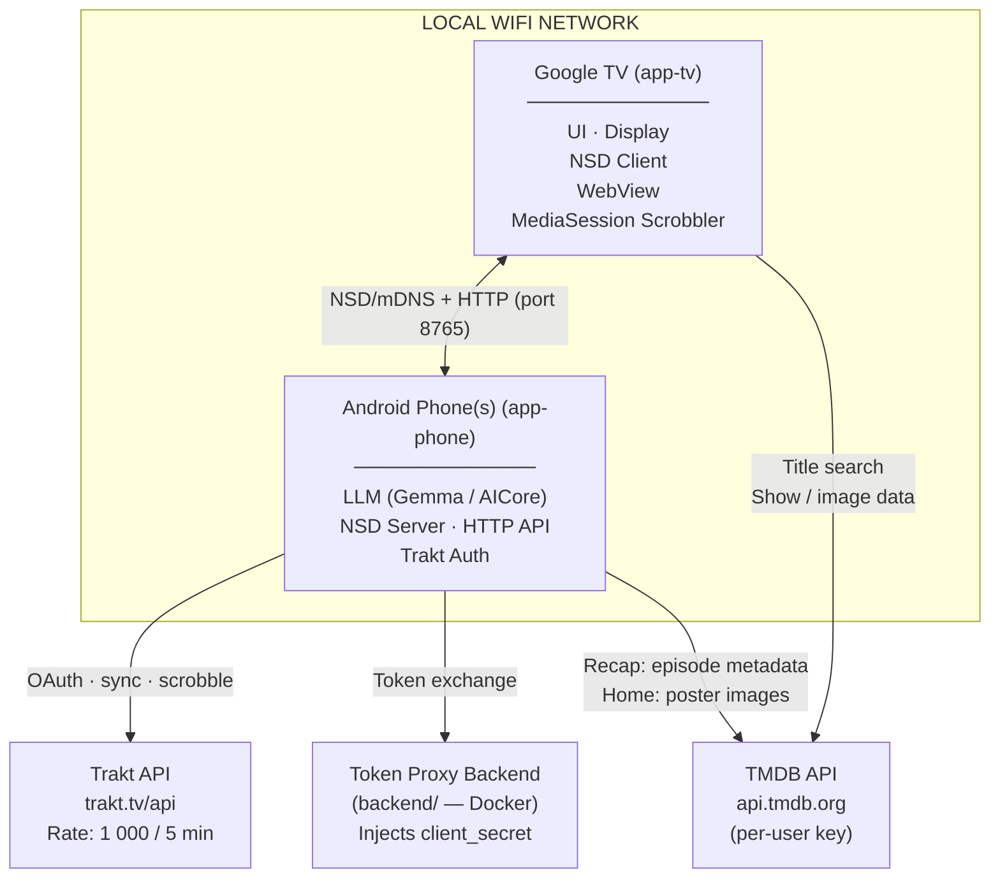
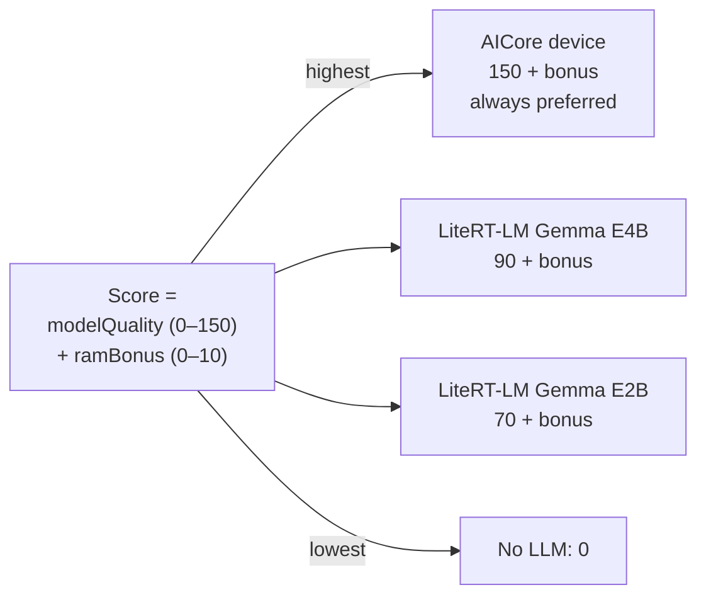
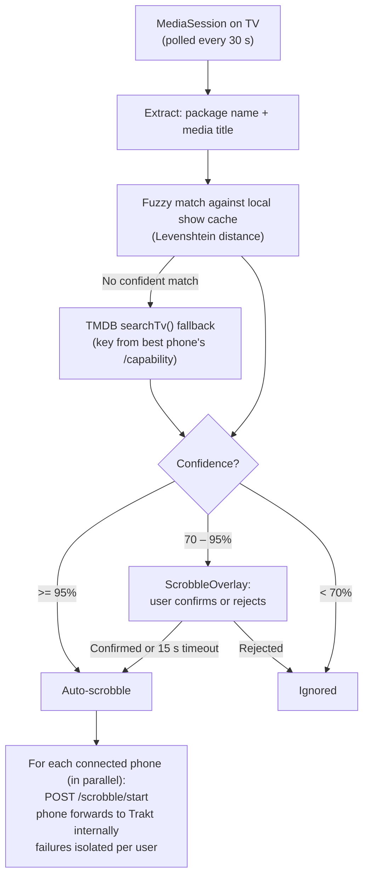

# WatchBuddy — Architecture Overview

## System Architecture



> For a detailed breakdown of TMDB API usage, user journeys, connection handling and error recovery, see [`docs/tmdb-integration.md`](tmdb-integration.md).

## Communication Protocol (TV ↔ Phone)

### NSD Service Registration (Phone side)
```
Service name:  watchbuddy-{username}
Service type:  _watchbuddy._tcp.
Port:          8765
TXT records:   version=0.15.1, modelQuality=70, llmBackend=LITERT
```

**TXT record contract:**
- `version` — the phone app's `versionName` (e.g. `0.15.1`), sourced from
  `BuildConfig.VERSION_NAME`. This is **not** a protocol version; the HTTP
  contract is versioned by endpoint. If a protocol version is ever needed, a
  new TXT key (`proto`) will be added — `version` will not be reused.
- `modelQuality` — integer 0–150, matches `LlmOrchestrator.LlmConfig.qualityScore`.
- `llmBackend` — one of the `LlmBackend` enum names. The TV parses this
  leniently: unknown values fall back to `LlmBackend.NONE` so a new phone-side
  enum value does not make the phone silently invisible to older TVs. Missing
  or unparseable `version` / `modelQuality`, however, cause the entry to be
  rejected outright.

### HTTP API (Phone exposes, TV calls)

| Method | Path | Description |
|--------|------|-------------|
| GET | `/capability` | Device info + LLM score + TMDB API key |
| GET | `/shows` | User's Trakt watched shows (cached) |
| POST | `/recap/{traktShowId}` | Generate HTML recap for a show |
| GET | `/auth/token` | Current access token (server-side, not used by TV) |
| POST | `/scrobble/start` | Forward scrobble start to this user's Trakt account |
| POST | `/scrobble/pause` | Forward scrobble pause to this user's Trakt account |
| POST | `/scrobble/stop` | Forward scrobble stop to this user's Trakt account |

**TV app API boundaries:**
- **TMDB API** — show/movie details, images, search (direct call from TV using key from `/capability`)
- **Phone API** — user library (`/shows`), scrobbling (`/scrobble/*`), recaps (`/recap/*`)
- **Trakt API** — never called directly by the TV; all Trakt operations are proxied via the phone

### Device Ranking (TV side)



**Failover chain:**


## LLM Strategy


Model updates: WorkManager (`ModelDownloadWorker`), WiFi only.
Auto-migrate to AICore if OS update adds support.
Model download URL is configurable in Advanced Settings (default: HuggingFace `litert-community`).

## Scrobbling Flow



Multi-user: when multiple phones are connected, each user's watch history is recorded
independently — one `/scrobble/*` call per phone, in parallel. A failure for one user
does not block the others. The TV never calls the Trakt API directly for any operation.

## Companion Service Lifecycle (Phone)

The phone's companion service is controlled via the "I am watching TV" toggle on the HomeScreen.
The toggle is visible only when both Trakt and TMDB connections are configured.

**State management:** `CompanionStateManager` (Hilt singleton) is the shared state hub between
the `CompanionService`, `CompanionHttpServer`, and `HomeViewModel`. It tracks:
- `lastCapabilityCheck` — timestamp of the most recent `/capability` request from a TV
- `lastScrobbleEvent` — the latest scrobble event for display on the phone HomeScreen
- `isServiceRunning` — whether the foreground service is active

**Auto-reconnect:** The service registers a `ConnectivityManager.NetworkCallback` for Wi-Fi.
When Wi-Fi is lost, NSD is unregistered (HTTP server stays alive). When Wi-Fi returns,
`onAvailable` is debounced for 2 s, then the existing registration is torn down and a fresh
one is registered 300 ms later. The unregister-then-register sequence is required because
`NsdManager.unregisterService` is asynchronous — calling `registerService` before the
teardown completes leaves duplicate advertisements on the network.

**NSD registration state machine:** `registerNsd` / `unregisterNsd` transition an
`IDLE → REGISTERING → REGISTERED → UNREGISTERING → IDLE` state under a single lock. The
state is flipped before calling the async `NsdManager` API so concurrent callers
(`onStartCommand` + Wi-Fi `onAvailable`) cannot race past the guard while a prior
registration is still in flight.

**Multicast lock (phone side):** The service acquires a `WifiManager.MulticastLock` for
its entire lifetime. Many phone OEM skins (OxygenOS, OneUI, MIUI) filter outgoing
multicast packets at the Wi-Fi driver unless an app holds this lock — without it, the
phone's NSD registration succeeds locally but no mDNS packets leave the radio, so peers
cannot discover it (TV-side discovery requires the same lock for the inbound path).

**NSD host pin:** The `NsdServiceInfo.host` is pinned to the phone's Wi-Fi IPv4 address
at registration time (resolved via `ConnectivityManager.getLinkProperties`). This prevents
`NsdManager` from advertising a wrong interface's address on multi-homed devices
(Wi-Fi + cellular, Wi-Fi + Ethernet dongle).

**HTTP server bind:** `CompanionHttpServer` binds Netty explicitly to `0.0.0.0` so the
listener accepts connections on the same Wi-Fi interface advertised via NSD.

**Cross-device discoverability note:** None of the code-level fixes above can overcome a
Wi-Fi access point that enforces client isolation (peer-to-peer traffic blocked at the
AP). If the TV cannot reach the phone even with both on the same SSID, verify that client
isolation / "AP isolation" / "Wi-Fi guest network" is disabled on the router.

**Presence timeout:** A coroutine checks `lastCapabilityCheck` every 60 seconds. If no TV
has polled `/capability` for 5 minutes, the service auto-deactivates and sets `companionEnabled = false`.

**App close:** `onTaskRemoved()` stops the service and clears `companionEnabled` when the user
swipes the app from recents.

**Service health sync:** `onStartCommand()` is idempotent — if `CompanionStateManager.isServiceRunning`
is already true the start is skipped, and `CompanionHttpServer.start()` additionally guards against
double-binding Netty.

## Presence Heartbeat (TV)

The TV's `PhoneDiscoveryManager` runs a heartbeat coroutine every 60 seconds that re-fetches
`GET /capability` for each discovered phone. This serves two purposes:

1. **Presence verification** — if a phone fails 3 consecutive heartbeats, it is removed from
   the discovered list and excluded from scrobbling.
2. **Capability refresh** — updated capability data (RAM, LLM backend) is reflected immediately.

The `MediaSessionScrobbler` additionally checks each phone's `lastSuccessfulCheck` timestamp
before sending scrobble requests. Phones with stale presence (> 2 minutes) are skipped to
avoid network timeouts during playback.

**mDNS reliability on TV hardware:** `PhoneDiscoveryManager` holds a
`WifiManager.MulticastLock` for the entire lifetime of active discovery. Many Android TV
ROMs (Google TV, Chromecast with Google TV, Shield, several Sony/TCL images) silently
drop inbound multicast packets at the Wi-Fi driver unless an app holds this lock, which
would otherwise make the phone undiscoverable even though the `CHANGE_WIFI_MULTICAST_STATE`
permission is granted. Discovery is also self-healing: `onStartDiscoveryFailed` with
`FAILURE_ALREADY_ACTIVE` triggers a delayed stop+start cycle, a `ConnectivityManager`
network callback restarts discovery when Wi-Fi returns, and an empty phone list at the
60 s heartbeat tick cycles discovery so the TV recovers from silent NSD failures without
requiring an app relaunch.

## Scrobble Event Display (Phone)

When the phone's HTTP server receives a scrobble event (`/scrobble/start|pause|stop`), it
emits a `ScrobbleDisplayEvent` via `CompanionStateManager`. The phone's HomeScreen observes
this flow and shows a "Now Watching" card with the show title, episode number, and action
(started / paused / finished). Events older than 30 minutes are auto-hidden.

## Secret Storage Strategy

### Private APK (sideload)
- `client_secret` embedded via NDK + hidden-secrets-gradle-plugin (XOR + signature binding)
- On first run: migrated to Android Keystore (TEE/hardware-backed)
- `access_token` / `refresh_token`: always in Android Keystore

### Play Store APK
- `client_secret` lives ONLY on the token proxy backend
- APK contains only `client_id` (public)
- 3 auth modes (configurable in Advanced Settings):
  1. **Managed** → `https://api.watchbuddy.app/trakt/token` (default)
  2. **Self-hosted** → user enters own proxy URL
  3. **Direct** → user enters own Client ID + Secret (stored in Keystore)

## Play Store Distribution

| | Phone APK | TV APK |
|---|---|---|
| Package name | `com.justb81.watchbuddy` | `com.justb81.watchbuddy` |
| versionCode | run_number × 10 + 1 | run_number × 10 + 2 |
| LAUNCHER | ✅ | ❌ |
| LEANBACK_LAUNCHER | ❌ | ✅ |
| touchscreen required | true | false |
| 64-bit (Aug 2026) | ✅ | ✅ |

## Deep Links

| Service | Package | Link Template |
|---------|---------|---------------|
| Netflix | `com.netflix.ninja` | `https://www.netflix.com/title/{tmdb_id}` |
| Prime Video | `com.amazon.amazonvideo.livingroom` | `https://www.primevideo.com/search?phrase={slug}` |
| Disney+ | `com.disney.disneyplus` | `https://www.disneyplus.com/series/{slug}/{tmdb_id}` |
| WaipuTV | `tv.waipu.app` | `waipu://tv` |
| Joyn | `de.prosiebensat1digital.android.joyn` | `https://www.joyn.de/serien/{slug}` |
| ARD | `de.swr.avp.ard.phone` | `https://www.ardmediathek.de/video/{id}` |
| ZDF | `de.zdf.android.app` | `https://www.zdf.de/serien/{slug}` |
