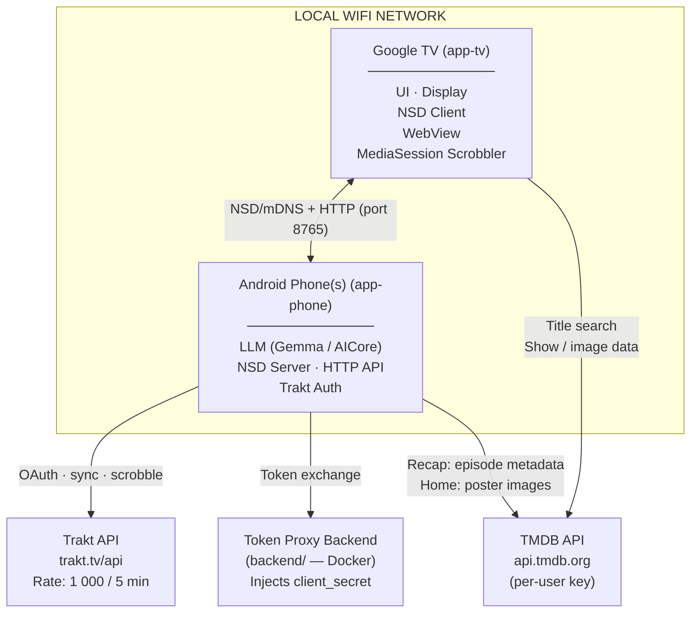
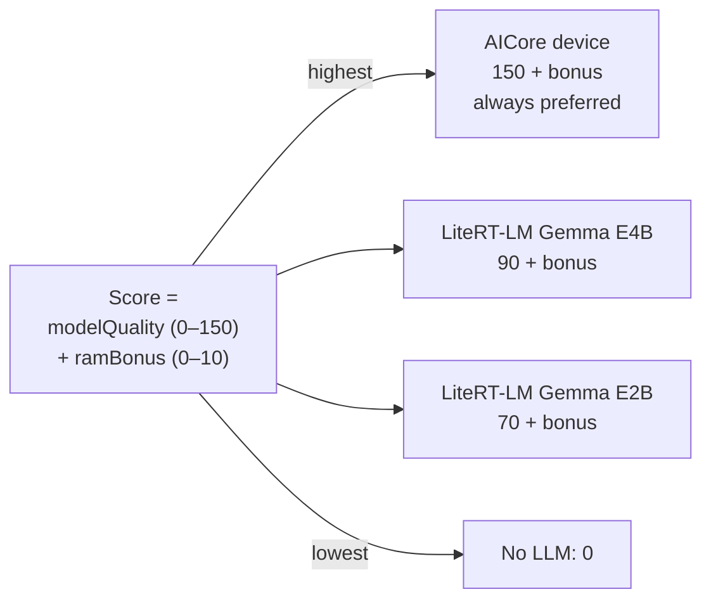
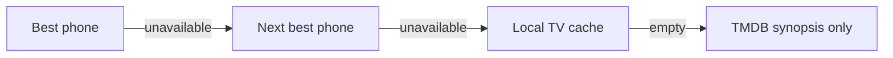
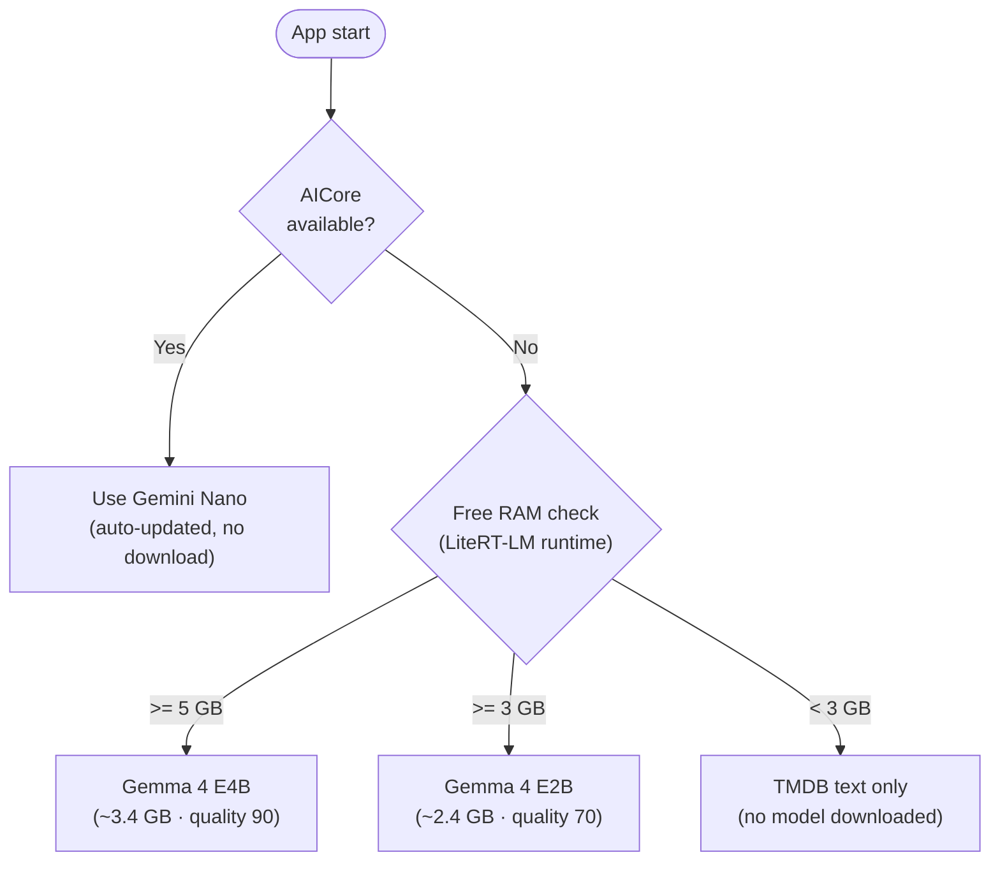
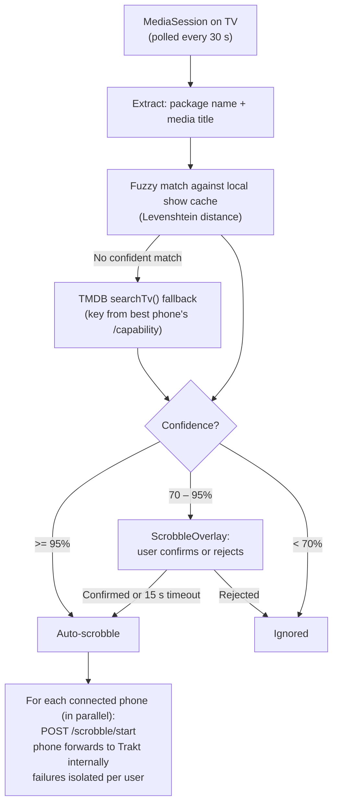

# WatchBuddy — Architecture Overview

## System Architecture



> For a detailed breakdown of TMDB API usage, user journeys, connection handling and error recovery, see [`docs/tmdb-integration.md`](tmdb-integration.md).

## Communication Protocol (TV ↔ Phone)

### NSD Service Registration (Phone side)
```
Service name:  watchbuddy-{username}
Service type:  _watchbuddy._tcp.
Port:          8765
TXT records:   version=1, modelQuality=70, llmBackend=LITERT
```

### HTTP API (Phone exposes, TV calls)

| Method | Path | Description |
|--------|------|-------------|
| GET | `/capability` | Device info + LLM score + TMDB API key |
| GET | `/shows` | User's Trakt watched shows (cached) |
| POST | `/recap/{traktShowId}` | Generate HTML recap for a show |
| GET | `/auth/token` | Current access token (server-side, not used by TV) |
| POST | `/scrobble/start` | Forward scrobble start to this user's Trakt account |
| POST | `/scrobble/pause` | Forward scrobble pause to this user's Trakt account |
| POST | `/scrobble/stop` | Forward scrobble stop to this user's Trakt account |

**TV app API boundaries:**
- **TMDB API** — show/movie details, images, search (direct call from TV using key from `/capability`)
- **Phone API** — user library (`/shows`), scrobbling (`/scrobble/*`), recaps (`/recap/*`)
- **Trakt API** — never called directly by the TV; all Trakt operations are proxied via the phone

### Device Ranking (TV side)



**Failover chain:**



## LLM Strategy



Model updates: WorkManager (`ModelDownloadWorker`), WiFi only.
Auto-migrate to AICore if OS update adds support.
Model download URL is configurable in Advanced Settings (default: HuggingFace `litert-community`).

## Scrobbling Flow



Multi-user: when multiple phones are connected, each user's watch history is recorded
independently — one `/scrobble/*` call per phone, in parallel. A failure for one user
does not block the others. The TV never calls the Trakt API directly for any operation.

## Secret Storage Strategy

### Private APK (sideload)
- `client_secret` embedded via NDK + hidden-secrets-gradle-plugin (XOR + signature binding)
- On first run: migrated to Android Keystore (TEE/hardware-backed)
- `access_token` / `refresh_token`: always in Android Keystore

### Play Store APK
- `client_secret` lives ONLY on the token proxy backend
- APK contains only `client_id` (public)
- 3 auth modes (configurable in Advanced Settings):
  1. **Managed** → `https://api.watchbuddy.app/trakt/token` (default)
  2. **Self-hosted** → user enters own proxy URL
  3. **Direct** → user enters own Client ID + Secret (stored in Keystore)

## Play Store Distribution

| | Phone APK | TV APK |
|---|---|---|
| Package name | `com.justb81.watchbuddy` | `com.justb81.watchbuddy` |
| versionCode | run_number × 10 + 1 | run_number × 10 + 2 |
| LAUNCHER | ✅ | ❌ |
| LEANBACK_LAUNCHER | ❌ | ✅ |
| touchscreen required | true | false |
| 64-bit (Aug 2026) | ✅ | ✅ |

## Deep Links

| Service | Package | Link Template |
|---------|---------|---------------|
| Netflix | `com.netflix.ninja` | `https://www.netflix.com/title/{tmdb_id}` |
| Prime Video | `com.amazon.amazonvideo.livingroom` | `https://www.primevideo.com/search?phrase={slug}` |
| Disney+ | `com.disney.disneyplus` | `https://www.disneyplus.com/series/{slug}/{tmdb_id}` |
| WaipuTV | `tv.waipu.app` | `waipu://tv` |
| Joyn | `de.prosiebensat1digital.android.joyn` | `https://www.joyn.de/serien/{slug}` |
| ARD | `de.swr.avp.ard.phone` | `https://www.ardmediathek.de/video/{id}` |
| ZDF | `de.zdf.android.app` | `https://www.zdf.de/serien/{slug}` |
