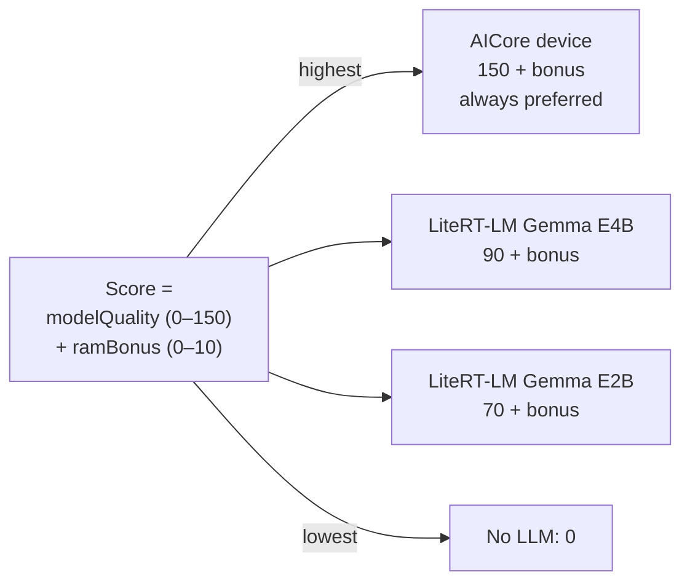
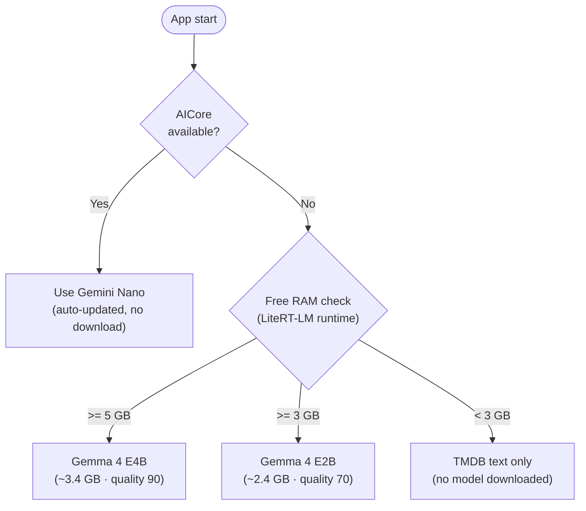
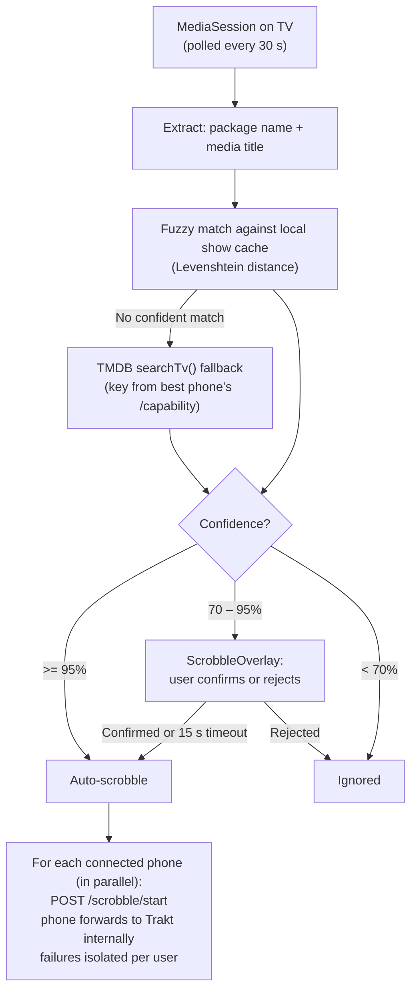

# WatchBuddy — Architecture Overview

## System Architecture


```mermaid
graph TB
    subgraph WIFI["LOCAL WIFI NETWORK"]
        TV["Google TV (app-tv)\n─────────────\nUI · Display\nBLE Scanner\nWebView\nMediaSession Scrobbler"]
        Phone["Android Phone(s) (app-phone)\n─────────────\nLLM (Gemma / AICore)\nBLE Advertiser · HTTP API\nTrakt Auth"]
        TV <-->|"BLE beacon + HTTP (port 8765)"| Phone
    end

    Phone -->|"OAuth · sync · scrobble"| Trakt["Trakt API\ntrakt.tv/api\nRate: 1 000 / 5 min"]
    Phone -->|"Token exchange"| Backend["Token Proxy Backend\n(backend/ — Docker)\nInjects client_secret"]
    Phone -->|"Recap: episode metadata\nHome: poster images"| TMDB["TMDB API\napi.tmdb.org\n(per-user key)"]
    TV -->|"Title search\nShow / image data"| TMDB
```

> For a detailed breakdown of TMDB API usage, user journeys, connection handling and error recovery, see [`docs/tmdb-integration.md`](tmdb-integration.md).

## Communication Protocol (TV ↔ Phone)

### BLE Advertisement (Phone side)

The phone broadcasts a BLE service-data beacon carrying its LAN endpoint so
the TV can connect over HTTP without relying on mDNS/multicast (which is blocked
by many home APs with client isolation, VLAN segmentation, or aggressive
multicast filtering). Schema v2 phones additionally emit a **scan response**
with the bearer token used to authenticate TV→phone HTTP requests.

#### Primary advertisement (schema v2, 9 bytes under `SERVICE_UUID`)

```
Service UUID:    5e4b4d3a-9f7c-4b7e-8e6b-6c0e5f27e4a0
Service data:    [schemaVersion (1B) | ipv4 (4B) | port (2B) | modelQuality (1B) | llmBackend ordinal (1B)]
Advertise mode:  ADVERTISE_MODE_BALANCED (~250 ms interval)
TX power:        ADVERTISE_TX_POWER_MEDIUM (~10 m, couch-to-TV)
Connectable:     false → ADV_SCAN_IND when scan response is present
```

Schema byte: `1` = legacy (v1, no auth), `2` = current (auth-capable, emits scan response).
The TV's `PhoneBleScanner` accepts both schema versions via two BLE scan filters.

#### Scan response (schema v2 only, 13 bytes under `TOKEN_SERVICE_UUID`)

```
Token UUID:      7a2c1f8b-3e5d-4c9a-b0e7-8d4f2a6c0b3e
Scan response:   [bearer token bytes (13B)]
```

When `tokenBytes` is provided, the advertiser emits a scan response (ADV_SCAN_IND)
under a separate `TOKEN_SERVICE_UUID` to avoid collision in Android's merged
`ScanRecord` service-data map. The 13 bytes are raw random material (104-bit
security); the TV Base64url-encodes them (18 chars, no padding) for use as
`Authorization: Bearer <token>` on every subsequent HTTP call.

Budget: scan response has no FLAGS AD, so all 31 bytes are available. Service
data header = 1 (len) + 1 (type 0x21) + 16 (UUID) = 18 bytes; 31 − 18 = **13
bytes** for the token. See `core/discovery/BleDiscoveryContract.kt`.

#### HTTP bearer authentication

All HTTP endpoints except `GET /capability` require:
```
Authorization: Bearer <Base64url(token)>
```
The token is generated once per phone install (13 random bytes → `SecureRandom`),
stored in Tink-AEAD-encrypted `SharedPreferences` (`watchbuddy_bearer_token`), and
distributed to the TV exclusively via the BLE scan response. `GET /capability` is
intentionally unauthenticated so the TV can call it before it has received the
token from BLE. `BearerTokenRepository` generates and persists the token; it is
stable until the user resets pairing.

The 9-byte primary advertisement payload is the authoritative wire contract — see
`core/discovery/BleDiscoveryContract.kt`. The rest of the phone's metadata
(avatar URL, username, TMDB API key, free RAM) is fetched over HTTP from
`GET /capability` once the TV has the IPv4 + port.

### HTTP API (Phone exposes, TV calls)

All endpoints except `GET /capability` require `Authorization: Bearer <token>` (token
distributed via BLE scan response; see above). Missing or wrong bearer returns HTTP 401.

| Method | Path | Description |
|--------|------|-------------|
| GET | `/capability` | Device info + LLM score + TMDB API key + `avatarSource` + `lastResolvedSessionKey` + `lastResolvedTraktId` (#342, #474) — **unauthenticated** |
| GET | `/avatar` | Custom avatar JPEG (200 bytes, ETag-revalidated; 404 when `avatarSource != CUSTOM`) |
| GET | `/shows` | User's Trakt watched shows (cached), paginated via `offset` + `limit` query params |
| POST | `/recap/{traktShowId}` | Generate HTML recap for a show |
| GET | `/auth/token` | Current Trakt access token (used by TV to obtain a token for authenticated calls) |
| POST | `/scrobble/start` | Forward scrobble start to this user's Trakt account |
| POST | `/scrobble/pause` | Forward scrobble pause to this user's Trakt account |
| POST | `/scrobble/stop` | Forward scrobble stop to this user's Trakt account |
| POST | `/scrobble/extract` | LLM fallback — accepts a `MediaMetadataSnapshot` + library hints, returns normalized `(showTitle, season?, episode?, confidence)`. TV calls this only when the deterministic multi-field + fuzzy-match cascade misses (< 0.70 cache confidence). 90 s client / 75 s server budget absorbs cold LiteRT-LM inference; per-raw-title in-flight dedup on the TV side prevents the 30 s `MediaSession` poll cycle from stacking duplicate inferences. |
| POST | `/scrobble/prompt` | Delivers an `AmbiguousScrobbleEvent` (top-3 candidates) to the phone; the phone presents a notification and/or in-app card so the user can pick the correct show. Returns HTTP 204 No Content. (#474) |
| POST | `/shows/add-to-library` | Adds a `PhoneAddToLibraryRequest` episode to the user's Trakt history. Called after the TV overlay confirmation for an unknown show. Invalidates the local show cache on success. |

**TV app API boundaries:**
- **TMDB API** — show/movie details, images, search (direct call from TV using key from `/capability`)
- **Phone API** — user library (`/shows`), scrobbling (`/scrobble/*`), recaps (`/recap/*`)
- **Trakt API** — never called directly by the TV; all Trakt operations are proxied via the phone

**TV discovery lifecycle (#344):** Discovery is user-controlled via two toggles in `TvSettingsScreen`, persisted in `StreamingPreferencesRepository`:
- `isPhoneDiscoveryEnabled` (default `true`) drives `PhoneDiscoveryManager.setEnabled(...)`; `TvHomeViewModel` simply observes the flow and forwards it — the ViewModel no longer stops discovery in `onCleared`, so discovery survives activity recreation and can also be owned by the background service below.
- `isAutostartEnabled` (default `false`) — when on, `BootReceiver` (exported, listening on `BOOT_COMPLETED`) starts the foreground `TvDiscoveryService` (FGS type `connectedDevice`) on device boot. The service holds a low-importance notification (channel `watchbuddy_tv_discovery`) and observes `isPhoneDiscoveryEnabled`; it self-stops when the user turns discovery off. `BootReceiver` is a plain `BroadcastReceiver` that reaches the Hilt singleton via `EntryPointAccessors`; it calls `goAsync()` and reads the DataStore preference on the Hilt-provided `@ApplicationScope` coroutine scope to avoid blocking the broadcast dispatch thread.

**TvDiscoveryService idle timeout (#540):** Android 14+ imposes a 24-hour cumulative FGS quota and Doze restrictions. To avoid holding the `connectedDevice` slot unnecessarily, `TvDiscoveryService` starts an `IdleTimeoutMonitor` coroutine whenever phone discovery is enabled. Two thresholds drive graceful self-stop (logged to `DiagnosticLog` so the Diagnostics screen explains why discovery is off):
- **No-discovery timeout (1 h):** if zero phones have been discovered since discovery was last enabled, the service stops and requires the user to re-toggle. This prevents indefinite FGS drain when no companion phone is in BLE range (e.g. autostart is on but the user is away from home).
- **All-unreachable timeout (30 min):** once at least one phone has been seen, if every previously-discovered phone has been absent for 30 consecutive minutes (evicted after 3 failed heartbeats), the service stops. This handles the case where the user leaves home or all phones lose power after an initial session. The clock resets every time a phone reappears, so brief Wi-Fi dropouts are tolerated. Toggling discovery off/on also resets both clocks via `IdleTimeoutMonitor.awaitTimeout` cancellation.

### Device Ranking (TV side)


```mermaid
flowchart LR
    Score["Score =\nmodelQuality (0–150)\n+ ramBonus (0–10)"]
    Score -->|"highest"| AICore["AICore device\n150 + bonus\nalways preferred"]
    Score --> E4B["LiteRT-LM Gemma E4B\n90 + bonus"]
    Score --> E2B["LiteRT-LM Gemma E2B\n70 + bonus"]
    Score -->|"lowest"| NoLLM["No LLM: 0"]
```

**Failover chain:**


```mermaid
flowchart LR
    P1["Best phone"] -->|unavailable| P2["Next best phone"]
    P2 -->|unavailable| Cache["Local TV cache"]
    Cache -->|empty| TMDB["TMDB synopsis only"]
```

## LLM Strategy


```mermaid
flowchart TD
    Start([App start]) --> AICore{"AICore\navailable?"}
    AICore -->|Yes| Gemini["Use Gemini Nano\n(auto-updated, no download)"]
    AICore -->|No| RAM{"Free RAM check\n(LiteRT-LM runtime)"}
    RAM -->|">= 5 GB"| E4B["Gemma 4 E4B\n(~3.4 GB · quality 90)"]
    RAM -->|">= 3 GB"| E2B["Gemma 4 E2B\n(~2.4 GB · quality 70)"]
    RAM -->|"< 3 GB"| TextOnly["TMDB text only\n(no model downloaded)"]
```

Model updates: WorkManager (`ModelDownloadWorker`), WiFi only.
Auto-migrate to AICore if OS update adds support.
Model download URL is configurable in Advanced Settings (default: HuggingFace `litert-community`).

## Scrobbling Flow


```mermaid
flowchart TD
    Poll["MediaSession on TV\n(polled every 30 s)"] --> Extract["Extract: package name + media title"]
    Extract --> Cache["Fuzzy match against local show cache\n(Levenshtein distance)"]
    Cache -->|"No confident match"| TMDBSearch["TMDB searchTv() fallback\n(key from best phone's /capability)"]
    Cache --> Conf{"Confidence?"}
    TMDBSearch --> Conf
    Conf -->|">= 95%"| Auto["Auto-scrobble"]
    Conf -->|"70 – 95%"| Overlay["ScrobbleOverlay:\nuser confirms or rejects"]
    Conf -->|"< 70%"| Ignore["Ignored"]
    Overlay -->|"Confirmed or 15 s timeout"| Auto
    Overlay -->|"Rejected"| Ignore
    Auto --> Parallel["For each connected phone (in parallel):\nPOST /scrobble/start\nphone forwards to Trakt internally\nfailures isolated per user"]
```

Multi-user: when multiple phones are connected, each user's watch history is recorded
independently — one `/scrobble/*` call per phone, in parallel. A failure for one user
does not block the others. The TV never calls the Trakt API directly for any operation.

## Manual Watched-State Marking (Phone)

Tapping a show on the phone `HomeScreen` opens `ShowDetailScreen`. The detail view
fetches the full season / episode structure for that show via Trakt
`GET shows/:id/seasons?extended=episodes`, wrapped in `EpisodeRepository` with a
10-minute per-show TTL cache. Each episode renders as a checkbox row reflecting its
watched state as derived from the user's existing `sync/watched/shows` cache in
`ShowRepository`.

Toggling a checkbox is **optimistic**: the UI flips immediately, the row is marked
pending, and `EpisodeRepository.markEpisode{Watched,Unwatched}` forwards the write to
Trakt `POST sync/history` or `POST sync/history/remove` with a single-show /
single-season / single-episode body. On success, `ShowRepository.updateLocalWatched(...)`
mutates the in-memory watched-shows list so any home-screen progress counter
recomputes live through the reactive `shows: StateFlow`. On failure the UI reverts
and a snackbar surfaces `show_detail_error_toggle`.

Default layout puts the user's current season (the lowest-numbered season at or
above the last-watched season that still has unwatched episodes) **first and
expanded**; every other season — older caught-up seasons, specials, future seasons —
sits below, collapsed behind a progress chip.

A connected TV picks up the change on its next 5-minute `/shows` poll from the phone.
The TV side has no write path for Trakt history; all manual edits originate from the
phone (#216).

## Companion Service Lifecycle (Phone)

The phone's companion service is controlled via the "I am watching TV" toggle on the HomeScreen.
The toggle is always visible, but is enabled only when all three prerequisites are satisfied:
Trakt is connected, TMDB is configured, **and** the phone is currently on a Wi-Fi network.
When any prerequisite is missing, the toggle is disabled and the reason is shown inline
(Trakt/TMDB missing vs. Wi-Fi missing). The Wi-Fi requirement is tracked reactively by
`phone/network/WifiStateProvider` (a `StateFlow<Boolean>` backed by a
`ConnectivityManager.registerDefaultNetworkCallback`).

**State management:** `CompanionStateManager` (Hilt singleton) is the shared state hub between
the `CompanionService`, `CompanionHttpServer`, and `HomeViewModel`. It tracks:
- `lastCapabilityCheck` — timestamp of the most recent `/capability` request from a TV
- `lastScrobbleEvent` — the latest scrobble event for display on the phone HomeScreen
- `isServiceRunning` — whether the foreground service is active

**Wi-Fi precondition & auto-stop:** `CompanionService.onStartCommand` probes
`wifiIpv4Address()` before doing any work. If the phone is not on Wi-Fi, the service clears
`companionEnabled` in settings, calls `stopSelf(startId)`, and returns `START_NOT_STICKY`
so the system does not re-deliver the start intent. While running, the service registers a
`ConnectivityManager.NetworkCallback` for Wi-Fi. When Wi-Fi is lost, the BLE advertiser is
stopped immediately and a 3 s grace timer runs; if Wi-Fi has not returned by then, the
service self-stops and clears `companionEnabled` so the foreground notification is
dismissed. The grace period tolerates brief SSID handoffs where `onLost(oldNet)` fires just
before `onAvailable(newNet)`. When Wi-Fi returns, `onAvailable` re-starts the advertiser
with the current IPv4 embedded in the payload (#278).

**HTTP server bind:** `CompanionHttpServer` binds Netty explicitly to `0.0.0.0` so the
listener accepts connections on the Wi-Fi interface whose address is embedded in the
BLE payload.

**BLE discovery (sole channel):** Discovery is BLE-only — no mDNS/NSD fallback. The
phone's `CompanionBleAdvertiser` (see `service/CompanionBleAdvertiser.kt`) broadcasts a
9-byte service-data payload (schema v2) under `SERVICE_UUID` containing the phone's IPv4
address, port, `modelQuality`, and `llmBackend` ordinal. A separate scan response under
`TOKEN_SERVICE_UUID` carries the 13-byte bearer token for HTTP auth (see above). The
advertisement is pinned to `ADVERTISE_MODE_BALANCED` + `ADVERTISE_TX_POWER_MEDIUM` (~10 m
range) and is not connectable (advertising type upgrades to ADV_SCAN_IND automatically
when a scan response is present). The TV's `PhoneBleScanner` listens with two filters
(v1 and v2) in `SCAN_MODE_BALANCED` whenever discovery is enabled; each match feeds the
existing `/capability` fetch + heartbeat pipeline, deduped by `baseUrl`. The bearer token
is extracted from the scan response and stored in `DiscoveredPhone.bearerToken`; it is
forwarded to `PhoneApiClientFactory.createClient(baseUrl, bearerToken)` for all
authenticated HTTP calls. BLE range can exceed the
LAN's reach — a phone that's out of Wi-Fi range but still within BLE range will fail
`/capability` and be evicted after `MAX_CONSECUTIVE_FAILURES = 5` heartbeat misses
with exponential backoff (~5 min total). Graceful degradation is the default: on Bluetooth-off, permission-denied, or
BLE-unsupported hardware the advertiser/scanner no-ops and the pair simply cannot
connect until BLE is available again. Permissions: `BLUETOOTH_ADVERTISE` (phone, runtime
prompt from HomeScreen when the "I am watching TV" toggle flips on) and `BLUETOOTH_SCAN`
with `neverForLocation` (TV, requested on `TvMainActivity.onCreate`).

**Presence timeout:** A coroutine checks `lastCapabilityCheck` every 60 seconds. If no TV
has polled `/capability` for 5 minutes, the service auto-deactivates and sets `companionEnabled = false`.

**App close:** `onTaskRemoved()` stops the service and clears `companionEnabled` when the user
swipes the app from recents.

**Service health sync:** `onStartCommand()` is idempotent — if `CompanionStateManager.isServiceRunning`
is already true the start is skipped, and `CompanionHttpServer.start()` additionally guards against
double-binding Netty.

**Foreground service type:** Both `CompanionService` (phone) and `TvDiscoveryService` (TV) run as
`connectedDevice` foreground services — **not** `dataSync`. The service maintains long-lived P2P
connectivity with a paired device (BLE advert / scan + Ktor HTTP heartbeat), which is exactly what
`connectedDevice` is intended for. Android 15/16 time-box `dataSync` FGS at ~6 h per 24 h and kill
the service with `ForegroundServiceDidNotStopInTimeException` once the quota is exhausted, which
was crashing the app on Android 16 devices (#459). The runtime `startForeground(id, notification,
type)` call must pass `ServiceInfo.FOREGROUND_SERVICE_TYPE_CONNECTED_DEVICE` so it matches the
manifest declaration on Android 14+. The `connectedDevice` type is authorised by the existing
`BLUETOOTH_ADVERTISE` (phone) / `BLUETOOTH_SCAN` (TV) permissions.

## Presence Heartbeat (TV)

The TV's `PhoneDiscoveryManager` runs a heartbeat coroutine every 60 seconds that re-fetches
`GET /capability` for each discovered phone. This serves two purposes:

1. **Presence verification** — if a phone fails 5 consecutive heartbeats (with exponential backoff), it is removed from
   the discovered list and excluded from scrobbling.
2. **Capability refresh** — updated capability data (RAM, LLM backend) is reflected immediately.

The `MediaSessionScrobbler` additionally checks each phone's `lastSuccessfulCheck` timestamp
before sending scrobble requests. Phones with stale presence (> 2 minutes) are skipped to
avoid network timeouts during playback.

**TV BLE scanner lifecycle:** `PhoneBleScanner` runs continuously in
`SCAN_MODE_BALANCED` while discovery is enabled (`isPhoneDiscoveryEnabled`
setting on; `TvDiscoveryService` foreground service alive). A
`ConnectivityManager.NetworkCallback` restarts the scanner on `onAvailable` in
case the BLE stack was silently reset by the Wi-Fi transition — no mDNS
re-register dance is needed since there is no mDNS.

**RSSI surfacing:** Every BLE scan result carries an RSSI in dBm. `PhoneBleScanner`
plumbs it through to `PhoneDiscoveryManager.onBleAdvertisement(…, rssi)`, which stores
the most recent value in `DiscoveredPhone.rssi` and refreshes it in place on repeat
adverts (heartbeat ticks don't carry a fresh RSSI, so the field only changes when the
BLE stack sees a new packet). The value is rendered read-only on TV Settings →
Diagnostics, per phone. RSSI is not yet used for filtering — that is tracked as a
potential follow-up once we have real-world distributions.

## Diagnostics View

Both apps expose a **Diagnostics** screen under Settings → Diagnostics. It renders the
live connection state from the shared singletons — `CompanionStateManager` on the phone,
`PhoneDiscoveryManager` on the TV — so end users (and agents triaging bug reports) can
distinguish the common causes of "TV can't see the phone":

- **Phone** — Wi-Fi on/off + IPv4, service running, HTTP listen address, age of the most
  recent TV `/capability` poll, BLE advertiser state + error code, last scrobble event,
  build info.
- **TV** — discovery active, heartbeat age, BLE scanner state + error code, one card per
  discovered phone (name, `baseUrl`, score, `modelQuality`, `llmBackend`, `failCount`,
  RSSI, age of `lastSuccessfulCheck`), build info.

Each row is colour-coded green / yellow / red so users can tell "no phones in BLE range"
apart from "`/capability` 500" (phone discovered, non-zero `failCount`). A "Share
diagnostics" button delegates to `DiagnosticShare.launchShare()`, which bundles the
current `DiagnosticLog` snapshot and any pending crash reports through the system share
sheet. The view is available in release builds; no new build variant was introduced
(#331).

## Scrobble Event Display (Phone)

When the phone's HTTP server receives a scrobble event (`/scrobble/start|pause|stop`), it
emits a `ScrobbleDisplayEvent` via `CompanionStateManager`. The phone's HomeScreen observes
this flow and shows a "Now Watching" card with the show title, episode number, and action
(started / paused / finished). Events older than 30 minutes are auto-hidden.

## Secret Storage Strategy

### Private APK (sideload)
- `client_secret` embedded via NDK + hidden-secrets-gradle-plugin (XOR + signature binding)
- On first run: migrated to Android Keystore (TEE/hardware-backed)
- `access_token` / `refresh_token`: always in Android Keystore

### Play Store APK
- `client_secret` lives ONLY on the token proxy backend
- APK contains only `client_id` (public)
- 3 auth modes (configurable in Advanced Settings):
  1. **Managed** → `https://watchbuddy.server.rang.it/trakt/token` (default; injected at build time via `TOKEN_BACKEND_URL`, self-hosters can override it in `local.properties`)
  2. **Self-hosted** → user enters own proxy URL
  3. **Direct** → user enters own Client ID + Secret (stored in Keystore)

## Play Store Distribution

| | Phone APK | TV APK |
|---|---|---|
| Package name | `com.justb81.watchbuddy` | `com.justb81.watchbuddy` |
| versionCode | run_number × 10 + 1 | run_number × 10 + 2 |
| LAUNCHER | ✅ | ❌ |
| LEANBACK_LAUNCHER | ❌ | ✅ |
| touchscreen required | true | false |
| 64-bit (Aug 2026) | ✅ | ✅ |

Release AABs are built with `debugSymbolLevel = "FULL"`, so AGP embeds per-AAB native debug symbols under `BUNDLE-METADATA` and Play Console auto-associates them for native crash/ANR symbolication. A per-module `native-debug-symbols.zip` is also attached to the GitHub Release for manual triage.

Release AABs likewise enable R8 (`isMinifyEnabled = true`), and AGP embeds the resulting `mapping.txt` inside each AAB so Play Console can de-obfuscate stack traces per versionCode. The Play upload is performed by [Gradle Play Publisher](https://github.com/Triple-T/gradle-play-publisher) (`./gradlew :app-phone:publishReleaseBundle`) in `artifactDir` mode, which uploads the phone + TV AABs as one atomic Play edit. Per-module `mapping.txt` files are also attached to the GitHub Release for manual symbolication.

## Deep Links

The available-provider list for each show is fetched from TMDB `/tv/{id}/watch/providers` (region-aware, keyed by device locale country code). No manual service selection is needed.

`core/deeplink/ProviderCatalog.kt` maps TMDB `provider_id` integers to Android package names only. Deep-link URLs are sourced from JustWatch's unofficial GraphQL API rather than hard-coded templates.

| TMDB provider_id | Service | Package |
|-----------------|---------|---------|
| 8 | Netflix | `com.netflix.ninja` |
| 9, 119 | Prime Video | `com.amazon.amazonvideo.livingroom` |
| 337 | Disney+ | `com.disney.disneyplus` |
| 350 | Apple TV+ | `com.apple.atve.androidtv.appletv` |
| 531 | Paramount+ | `com.cbs.app` |
| 1899 | Max / HBO | `com.hbo.hbonow` |
| 2187 | WaipuTV | `de.exaring.waipu` |
| 2184 | Joyn / 7TV | `de.prosiebensat1digital.seventv` |
| 192 | YouTube | `com.google.android.youtube.tv` |
| 35 | Rakuten TV | `tv.wuaki.apptv` |
| 195 | ARD Mediathek | `de.swr.avp.ard.tv` |
| 231 | ZDF Mediathek | `com.zdf.android.mediathek` |

### JustWatch-powered per-episode deep links

`JustWatchDeepLinkRepository` resolves streaming URLs by querying JustWatch's unofficial GraphQL API (`https://apis.justwatch.com/graphql`) and caching results in a Room database (`justwatch_deep_links.db`) on the TV device.

**Resolution cascade** for each `(tmdbShowId, season, episode, providerId, countryCode)`:
1. Episode-level Room cache lookup (positive hit: return URL immediately)
2. If miss or expired negative: live JustWatch call via three sequential GraphQL queries — `SEARCH_QUERY` (find show by title, verify TMDB ID), `SEASONS_QUERY` (get season node IDs), `EPISODES_QUERY` (get episode offers). Caches all providers found and negatives for known providers not returned.
3. Show-level Room cache lookup (season=0, episode=0)
4. Show-level live JustWatch call (single search query, no episode drill-down)
5. Returns `null` → caller treats as `DeepLinkState.Unavailable`

**Caching policy:** Positive hits cached permanently. Negative entries (no offer found) expire after 30 days (`NEGATIVE_TTL_MS`). Network exceptions do not write negatives — the next call retries the API.

**Batch dedup:** A `Mutex`-protected `Map<FetchKey, Mutex>` prevents duplicate in-flight JustWatch API calls when multiple coroutines request the same `(showId, season, episode, countryCode)` simultaneously. After acquiring the per-key lock, the cache is re-checked before calling the API.

**Provider mapping:** `JustWatchPackageMap` (`core/justwatch/`) maps JustWatch `technicalName` strings (e.g. `netflix`, `amazonprime`, `disneyplus`) to TMDB `provider_id` integers. The same map drives negative-cache writes for known-but-absent providers.

**ViewModel integration:** `ShowDetailViewModel.loadDeepLinks()` is triggered once `ProviderListUiState.Success` arrives. Each provider gets a `viewModelScope.async` backed by `JustWatchDeepLinkRepository`; in-flight dedup at the ViewModel level prevents duplicate `Deferred` jobs per key. State is `deepLinks: StateFlow<Map<Int, DeepLinkState>>` with `DeepLinkState = Loading | Available(url) | Unavailable`. The UI shows a spinner overlay on loading chips, disables unavailable chips, and displays a JustWatch attribution badge when any link is `Available`.

**Diagnostics:** `TvDiagnosticsScreen` shows a "Streaming Links" section with cached URL count, negative entry count, last-fetch timestamp, and a "Clear cache" button.

### Provider ordering on ShowDetail

`WatchProvidersRepository.getResolvedProviders()` composes the final list in this order:
1. **Last-used** provider for this show (from `LastUsedProviderRepository`, TV-local DataStore)
2. **Installed** providers (cross-referenced with `InstalledAppsProbe` via `PackageManager`)
3. **Not-installed** providers (only when "Show unavailable services" setting is on)

The last-used entry is recorded when the user taps a provider chip or a confirmed scrobble is attributed to a known package. `InstalledAppsProbe` caches installed packages and invalidates on `ACTION_PACKAGE_ADDED`/`ACTION_PACKAGE_REMOVED`.

All known streaming package names are declared in a `<queries>` block in `app-tv/AndroidManifest.xml` so PackageManager reports them on Android 11+.
