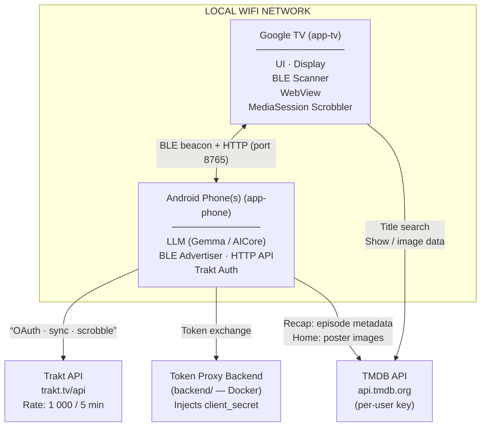
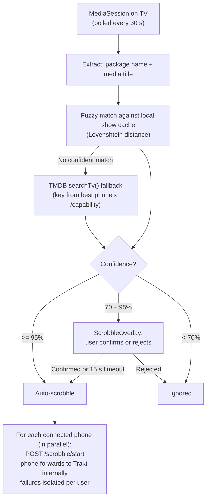
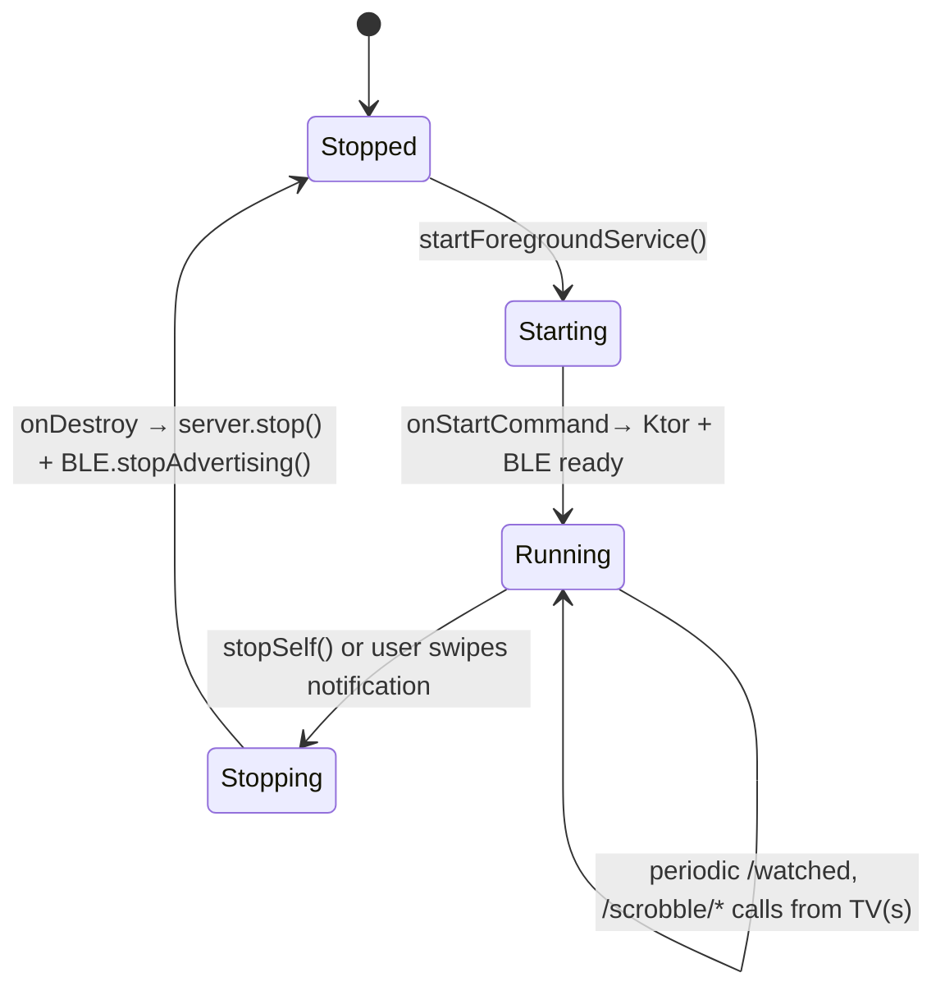
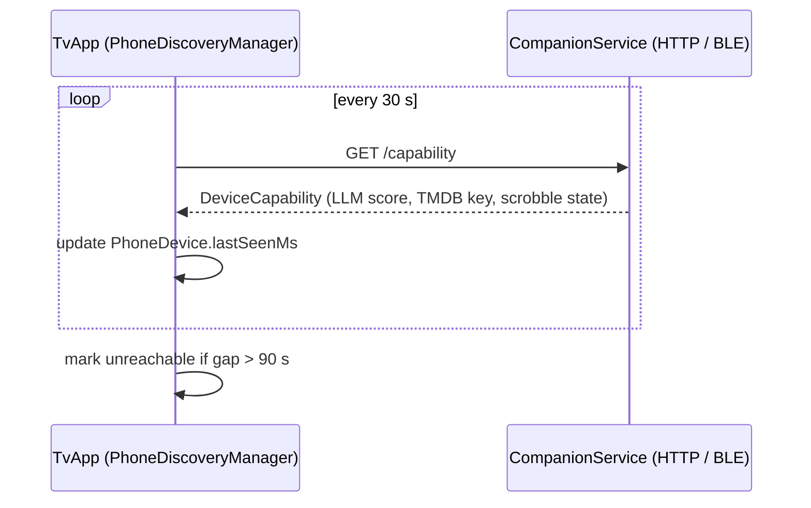

# WatchBuddy — Architecture Overview

## System Architecture


```mermaid
graph TB
    subgraph WIFI["LOCAL WIFI NETWORK"]
        TV["Google TV (app-tv)\n─────────────\nUI · Display\nBLE Scanner\nWebView\nMediaSession Scrobbler"]
        Phone["Android Phone(s) (app-phone)\n─────────────\nLLM (Gemma / AICore)\nBLE Advertiser · HTTP API\nTrakt Auth"]
        TV <-->|"BLE beacon + HTTP (port 8765)"| Phone
    end

    Phone -->|“OAuth · sync · scrobble”| Trakt["Trakt API\ntrakt.tv/api\nRate: 1 000 / 5 min"]
    Phone -->|"Token exchange"| Backend["Token Proxy Backend\n(backend/ — Docker)\nInjects client_secret"]
    Phone -->|"Recap: episode metadata\nHome: poster images"| TMDB["TMDB API\napi.tmdb.org\n(per-user key)"]
    TV -->|"Title search\nShow / image data"| TMDB
```

> For a detailed breakdown of TMDB API usage, user journeys, connection handling and error recovery, see [`docs/tmdb-integration.md`](tmdb-integration.md).

## Communication Protocol (TV ↔ Phone)

### BLE Advertisement (Phone side)

The phone broadcasts a BLE service-data beacon carrying its LAN endpoint so
the TV can connect over HTTP without relying on mDNS/multicast (which is blocked
by many home APs with client isolation, VLAN segmentation, or aggressive
multicast filtering). Schema v2 phones additionally emit a **scan response**
with the bearer token used to authenticate TV→phone HTTP requests.

#### Primary advertisement (schema v2, 9 bytes under `SERVICE_UUID`)

```
Service UUID:    5e4b4d3a-9f7c-4b7e-8e6b-6c0e5f27e4a0
Service data:    [schemaVersion (1B) | ipv4 (4B) | port (2B) | modelQuality (1B) | llmBackend ordinal (1B)]
Advertise mode:  ADVERTISE_MODE_BALANCED (~250 ms interval)
TX power:        ADVERTISE_TX_POWER_MEDIUM (~10 m, couch-to-TV)
Connectable:     false → ADV_SCAN_IND when scan response is present
```

Schema byte: `1` = legacy (v1, no auth), `2` = current (auth-capable, emits scan response).
The TV's `PhoneBleScanner` accepts both schema versions via two BLE scan filters.

#### Scan response (schema v2 only, 13 bytes under `TOKEN_SERVICE_UUID`)

```
Token UUID:      7a2c1f8b-3e5d-4c9a-b0e7-8d4f2a6c0b3e
Scan response:   [bearer token bytes (13B)]
```

When `tokenBytes` is provided, the advertiser emits a scan response (ADV_SCAN_IND)
under a separate `TOKEN_SERVICE_UUID` to avoid collision in Android's merged
`ScanRecord` service-data map. The 13 bytes are raw random material (104-bit
security); the TV Base64url-encodes them (18 chars, no padding) for use as
`Authorization: Bearer <token>` on every subsequent HTTP call.

Budget: scan response has no FLAGS AD, so all 31 bytes are available. Service
data header = 1 (len) + 1 (type 0x21) + 16 (UUID) = 18 bytes; 31 − 18 = **13
bytes** for the token. See `core/discovery/BleDiscoveryContract.kt`.

### HTTP API (TV → Phone)

All endpoints except `GET /capability` require `Authorization: Bearer <token>` (token
distributed via BLE scan response; see above). Missing or wrong bearer returns HTTP 401.
Route handlers live under `phone/server/routes/` as per-feature Ktor extension functions.

| Method | Path | Description |
|--------|------|-------------|
| GET | `/capability` | Device info + LLM score + TMDB API key + `avatarSource` + `lastResolvedSessionKey` + `lastResolvedTraktId` (#342, #474) — **unauthenticated** |
| GET | `/provider-catalog` | Streaming provider catalog (Netflix, Disney+, etc.) with TMDB provider IDs and package names; ETag-revalidated (`Cache-Control: public, max-age=86400`); 404 until the catalog has been fetched from the backend — **unauthenticated** |
| GET | `/avatar` | Custom avatar JPEG (200 bytes, ETag-revalidated; 404 when `avatarSource != CUSTOM`) |
| GET | `/shows` | User's Trakt watched shows (cached), paginated via `offset` + `limit` query params |
| POST | `/recap/{traktShowId}` | Generate HTML recap for a show |
| POST | `/scrobble/start` | Forward scrobble start to this user's Trakt account |
| POST | `/scrobble/pause` | Forward scrobble pause to this user's Trakt account |
| POST | `/scrobble/stop` | Forward scrobble stop to this user's Trakt account |
| POST | `/scrobble/extract` | LLM fallback — accepts a `MediaMetadataSnapshot` + library hints, returns normalized `(showTitle, season?, episode?, confidence)`. TV calls this only when the deterministic multi-field + fuzzy-match cascade misses (< 0.70 cache confidence). 90 s client / 75 s server budget absorbs cold LiteRT-LM inference; per-raw-title in-flight dedup on the TV side prevents the 30 s `MediaSession` poll cycle from stacking duplicate inferences. |
| POST | `/scrobble/prompt` | Delivers an `AmbiguousScrobbleEvent` (top-3 candidates) to the phone; the phone presents a notification and/or in-app card so the user can pick the correct show. Returns HTTP 204 No Content. (#474) |
| POST | `/shows/add-to-library` | Adds a `PhoneAddToLibraryRequest` episode to the user's Trakt history. Called after the TV overlay confirmation for an unknown show. Invalidates the local show cache on success. |

**TV app API boundaries:**
- **TMDB API** — show/movie details, images, search (direct call from TV using key from `/capability`)
- **JustWatch GraphQL** — deep-link URL resolution for streaming apps (TV only)
- **Trakt API** — proxied through phone; TV never calls Trakt directly

### Heartbeat / Presence

The TV polls each phone's `/capability` every **30 s**. A phone is considered
**unreachable** after **90 s** without a successful response. The poll loop runs in
`PhoneDiscoveryManager`, which holds a `StateFlow<List<PhoneDevice>>` as the live
roster of connected phones. `TvHomeViewModel` derives its "active viewers" list from
this flow.

### Phone-Side State Lifecycle

`CompanionService` (foreground service on the phone) starts the Ktor HTTP server
and the BLE advertiser together in `onCreate`, and tears them down in `onDestroy`.
`CompanionStateManager` is the shared singleton that holds the `DeviceCapability`
and any in-flight scrobble session, so multiple Ktor coroutines and the BLE layer
can read/write it without a direct dependency on the `Service` object.

## LLM Strategy

The phone hosts an on-device language model. Two runtimes are supported:

| Runtime | Model family | Scoring |
|---------|-------------|--------|
| LiteRT-LM | Gemma (2B, 4B) in `.litertlm` format | `modelQuality` 50–150 |
| AICore (Gemini Nano) | System model, no APK weight | `modelQuality` 1–49 |
| None | No LLM | `modelQuality` 0 |

`LlmOrchestrator` picks the highest-scoring available backend at startup and
exposes a `suspend fun generate(prompt: String): Flow<String>` that streams
tokens. The TV picks the phone with the highest `modelQuality` for each recap
or title-extraction call.

### Title Extraction

`LlmTitleExtractor` on the phone receives a `TitleExtractionRequest` (raw
`MediaMetadataSnapshot` + a library-hint list) and returns a
`TitleExtractionResponse`. The LLM prompt instructs the model to:
1. Strip ads, episode numbers, and streaming-service branding from the raw title.
2. Prefer a library match when the normalised title is close to a hint.
3. Return `(showTitle, season?, episode?, confidence)`.

The TV validates `confidence` (clamped server-side to `[0.0, 1.0]`) and only uses
the response when it is ≥ 0.40.

## Scrobbling Flow


```mermaid
flowchart TD
    Poll["MediaSession on TV\n(polled every 30 s)"] --> Extract["Extract: package name + media title"]
    Extract --> Cache["Fuzzy match against local show cache\n(Levenshtein distance)"]
    Cache -->|"No confident match"| TMDBSearch["TMDB searchTv() fallback\n(key from best phone's /capability)"]
    Cache --> Conf{"Confidence?"}
    TMDBSearch --> Conf
    Conf -->|">= 95%"| Auto["Auto-scrobble"]
    Conf -->|"70 – 95%"| Overlay["ScrobbleOverlay:\nuser confirms or rejects"]
    Conf -->|"< 70%"| Ignore["Ignored"]
    Overlay -->|"Confirmed or 15 s timeout"| Auto
    Overlay -->|"Rejected"| Ignore
    Auto --> Parallel["For each connected phone (in parallel):\nPOST /scrobble/start\nphone forwards to Trakt internally\nfailures isolated per user"]
```

Multi-user: when multiple phones are connected, each user's watch history is recorded
independently — one `/scrobble/*` call per phone, in parallel. A failure for one user
does not block the others. The TV never calls the Trakt API directly for any operation.

**Episode resolution** is handled by two pure functions in `core/scrobbler/`:
- `EpisodeMarkerExtractor` — builds pattern lists from an `AppProfile` and extracts `(season, episode)` markers from text fields. No I/O or side effects.
- `resolveEpisodeFromMetadata()` — given an optional explicit marker, a fetched `TmdbProgressHint`, a confidence score, and tuning constants, returns a sealed `EpisodeResolutionResult` (`Resolved`, `Ambiguous`, or `Unresolved`). No I/O or side effects; `MediaSessionScrobbler` injects `DiagnosticLog` calls at the call boundary.

## Manual Watched-State Marking (Phone)

Tapping a show on the phone `HomeScreen` opens `ShowDetailScreen`. The detail view
fetches the full season / episode structure for that show via Trakt
`GET shows/:id/seasons?extended=episodes`, wrapped in `EpisodeRepository` with a
10-minute TTL. The user can tap any episode checkbox to toggle its watched state.

`EpisodeRepository.markWatched` / `markUnwatched` call Trakt's sync/history endpoints
and optimistically update the local state so the UI responds immediately. A background
refresh corrects any divergence. The repository is injected via Hilt and shared
between `ShowDetailViewModel` (phone) and `CompanionHttpServer` (which exposes
`GET /shows` backed by the same reactive `StateFlow`).

## Companion Service Lifecycle (Phone)


```mermaid
stateDiagram-v2
    [*] --> Stopped
    Stopped --> Starting : startForegroundService()
    Starting --> Running : onStartCommand→ Ktor + BLE ready
    Running --> Running : periodic /watched, /scrobble/* calls from TV(s)
    Running --> Stopping : stopSelf() or user swipes notification
    Stopping --> Stopped : onDestroy → server.stop() + BLE.stopAdvertising()
```

`CompanionService.onStartCommand` calls `startForeground()` immediately (before any
async work) to satisfy Android 12’s foreground-service start rules. The Ktor server
and BLE advertiser are both launched in `lifecycleScope` so they are cancelled
automatically when the service is destroyed.

**Wi-Fi guard:** `WifiStateProvider` monitors `ConnectivityManager` network callbacks
and exposes a `StateFlow<Boolean>`. `HomeViewModel` collects it and shows a
"Wi-Fi required" banner when the phone is on mobile data. The companion service does
not stop when Wi-Fi is lost — it keeps the server alive so the TV can reconnect
immediately when Wi-Fi returns, without requiring the user to restart the service.

**Handoff on reconnect:** When the TV's BLE scanner finds the phone's advertisement
again after a gap, it re-calls `/capability` and gets a fresh `DeviceCapability`
bundle. Because the phone’s `lastResolvedSessionKey` is included in every
`/capability` response, the TV can discard the pending `AmbiguousScrobbleEvent`
for that session without an extra round-trip.

## Presence Heartbeat (TV)


```mermaid
sequenceDiagram
    participant TV as TvApp (PhoneDiscoveryManager)
    participant Phone as CompanionService (HTTP / BLE)
    loop every 30 s
        TV->>Phone: GET /capability
        Phone-->>TV: DeviceCapability (LLM score, TMDB key, scrobble state)
        TV->>TV: update PhoneDevice.lastSeenMs
    end
    TV->>TV: mark unreachable if gap > 90 s
```

The 90-second window is intentionally 3× the poll interval so that a single
missed response (e.g. phone screen-off CPU throttle) does not immediately drop
the phone from the roster.

`PhoneDiscoveryManager` maintains a `Map<deviceId, PhoneDevice>` keyed by the
`DeviceCapability.deviceId`. A new BLE advertisement for an already-known device
updates the IP+port entry rather than adding a duplicate. The `StateFlow` emits
a new list on every poll-cycle completion, whether the set changed or not, so
ViewModels that derive "active viewer count" stay accurate.

## Diagnostics View

### Phone (`DiagnosticsScreen`)

`DiagnosticsViewModel` surfaces:
- **Wi-Fi state** — collected from `WifiStateProvider`
- **HTTP server** — port number + request count (from `CompanionHttpServer.requestCount`)
- **BLE advertiser** — `isAdvertising` flag from `CompanionBleAdvertiser`
- **Share** button — dumps a plain-text diagnostic report via Android `ACTION_SEND`

The Share report includes: device info, Wi-Fi SSID + IP, server port + request count,
BLE advertising state, and the last 100 entries from `DiagnosticLog` (ring buffer,
thread-safe).

### TV (`TvDiagnosticsScreen`)

`TvDiagnosticsViewModel` surfaces:
- **Discovery** — list of discovered phones with IP, model quality, last-seen delta
- **BLE scanner** — scan state and last-seen timestamp
- **Scrobble** — current scrobble session state (show + episode + confidence)
- **Deep links** — JustWatch cache stats (count, negative count, last-fetch timestamp) + "Clear cache" button

The TV diagnostics screen is view-only (no Share button). The "Clear cache" button
calls `JustWatchDeepLinkRepository.clearAll()` and updates the displayed counts
immediately.

## Scrobble Event Display (Phone)

When the TV sends `POST /scrobble/start` the phone records a `ScrobbleDisplayEvent`
(show + episode + progress + timestamp) in a `MutableStateFlow`. The phone UI shows
a transient "Now watching" card via `HomeViewModel.currentScrobble`. The card
automatically fades after the TV sends `POST /scrobble/stop` or after a 5-minute
timeout.

## Secret Storage Strategy

| Secret | Phone storage | TV storage |
|--------|--------------|------------|
| Trakt access token | `EncryptedSharedPreferences` (Keystore-backed AES-256-GCM) | Never stored |
| Trakt refresh token | Same as above | Never stored |
| TMDB API key | `DataStore` (plain, user-provided) | Memory only (from `/capability`) |
| BLE bearer token | `DataStore` (plain random bytes) | Memory only (from scan response) |
| OAuth client secret | Backend only (never in APK) | Never involved |

Trakt tokens are wrapped in `EncryptedSharedPreferences` with a Keystore-backed
material key (`KeyProperties.BLOCK_MODE_GCM`, `KEY_PURPOSE_ENCRYPT | DECRYPT`).
Decryption requires the same device + Android user — backup / restore across
devices will not expose the plaintext token.

## Play Store Distribution

The release pipeline (`.github/workflows/release.yml`) is triggered by
`release-please--branches--main` PR merges. On merge:

1. `release-please` bumps `version` in `gradle/libs.versions.toml` and creates a
   GitHub Release tag (`v{major}.{minor}.{patch}`).
2. The `release.yml` workflow is triggered by the new tag. It:
   a. Checks out the tag.
   b. Builds signed APKs and AABs for both phone and TV (`./gradlew
      :app-phone:bundleRelease :app-tv:bundleRelease`).
   c. Attaches signed APKs, AABs, ProGuard mapping files, and native debug
      symbols to the GitHub Release.
   d. Uploads the phone AAB to Google Play internal track via Gradle Play
      Publisher (`./gradlew :app-phone:publishReleaseBundle`).

VersionCode is `github.run_number * 10 + {1 for phone, 2 for TV}` to guarantee
uniqueness across both apps in the same Play Store account.

## Deep Links

The available-provider list for each show is fetched from TMDB `/tv/{id}/watch/providers` (region-aware, keyed by device locale country code). No manual service selection is needed.

`core/deeplink/ProviderCatalogRegistry.kt` is the single source of truth for all provider catalog lookups — it maps TMDB `provider_id` integers to Android package names and JustWatch `technicalName` strings to TMDB provider IDs. Deep-link URLs are sourced from JustWatch's unofficial GraphQL API rather than hard-coded templates.

| TMDB provider_id | Service | Package |
|-----------------|---------|--------|
| 8 | Netflix | `com.netflix.ninja` |
| 9, 119 | Prime Video | `com.amazon.amazonvideo.livingroom` |
| 337 | Disney+ | `com.disney.disneyplus` |
| 350 | Apple TV+ | `com.apple.atve.androidtv.appletv` |
| 531 | Paramount+ | `com.cbs.app` |
| 1899 | Max / HBO | `com.hbo.hbonow` |
| 2187 | WaipuTV | `de.exaring.waipu` |
| 2184 | Joyn | `de.prosiebensat1.joyn.tv` |
| 192 | YouTube | `com.google.android.youtube.tv` |
| 35 | Rakuten TV | `tv.wuaki.apptv` |
| 195 | ARD Mediathek | `de.swr.avp.ard.tv` |
| 231 | ZDF Mediathek | `com.zdf.android.mediathek` |

### JustWatch-powered per-episode deep links

`JustWatchDeepLinkRepository` resolves streaming URLs by querying JustWatch's unofficial GraphQL API (`https://apis.justwatch.com/graphql`) and caching results in a Room database (`justwatch_deep_links.db`) on the TV device.

**Resolution cascade** for each `(tmdbShowId, season, episode, providerId, countryCode)`:
1. Episode-level Room cache lookup (positive hit: return URL immediately)
2. If miss or expired negative: live JustWatch call via three sequential GraphQL queries — `SEARCH_QUERY` (find show by title, verify TMDB ID), `SEASONS_QUERY` (get season node IDs), `EPISODES_QUERY` (get episode offers). Caches all providers found and negatives for known providers not returned.
3. Show-level Room cache lookup (season=0, episode=0)
4. Show-level live JustWatch call (single search query, no episode drill-down)
5. Returns `null` → caller treats as `DeepLinkState.Unavailable`

**Caching policy:** Positive hits cached permanently. Negative entries (no offer found) expire after 30 days (`NEGATIVE_TTL_MS`). Network exceptions do not write negatives — the next call retries the API.

**Batch dedup:** A `Mutex`-protected `Map<FetchKey, Mutex>` prevents duplicate in-flight JustWatch API calls when multiple coroutines request the same `(showId, season, episode, countryCode)` simultaneously. After acquiring the per-key lock, the cache is re-checked before calling the API.

**Provider mapping:** `ProviderCatalogRegistry` (`core/deeplink/`) maps JustWatch `technicalName` strings (e.g. `netflix`, `amazonprime`, `disneyplus`) to TMDB `provider_id` integers via `providerIdByJustWatchName()`. The same registry drives negative-cache writes for known-but-absent providers.

**ViewModel integration:** `ShowDetailViewModel.loadDeepLinks()` is triggered once `ProviderListUiState.Success` arrives. Each provider gets a `viewModelScope.async` backed by `JustWatchDeepLinkRepository`; in-flight dedup at the ViewModel level prevents duplicate `Deferred` jobs per key. State is `deepLinks: StateFlow<Map<Int, DeepLinkState>>` with `DeepLinkState = Loading | Available(url) | Unavailable`. The UI shows a spinner overlay on loading chips, disables unavailable chips, and displays a JustWatch attribution badge when any link is `Available`.

**Launch cascade (`launchProvider` in `ShowDetailScreen.kt`):** When the user taps a provider chip or the "Watch Now" button, a four-stage cascade fires in order: (1) targeted `ACTION_VIEW` with the JustWatch deep-link URL pinned to the provider's package; (2) untargeted `ACTION_VIEW` with the same URL; (3) `PackageManager.getLaunchIntentForPackage` — attempted whenever the package is actually present on the device, regardless of whether `ResolvedProvider.isInstalled` is true (guards against stale `InstalledAppsProbe` caches and region-variant APK package names not in `ProviderCatalogRegistry`); (4) open `ResolvedProvider.tmdbPageUrl` in the system browser. If every stage fails the caller's `onFailure` callback fires and a WatchBuddy snackbar is shown; the system "no app for that" dialog is never surfaced.

**Diagnostics:** `TvDiagnosticsScreen` shows a "Streaming Links" section with cached URL count, negative entry count, last-fetch timestamp, and a "Clear cache" button.

### Provider ordering on ShowDetail

`WatchProvidersRepository.getResolvedProviders()` composes the final list in this order:
1. **Last-used** provider for this show (from `LastUsedProviderRepository`, TV-local DataStore)
2. **Installed** providers (cross-referenced with `InstalledAppsProbe` via `PackageManager`)
3. **Not-installed** providers (only when "Show unavailable services" setting is on)

The last-used entry is recorded when the user taps a provider chip or a confirmed scrobble is attributed to a known package. `InstalledAppsProbe` caches installed packages and invalidates on `ACTION_PACKAGE_ADDED`/`ACTION_PACKAGE_REMOVED`.

All known streaming package names are declared in a `<queries>` block in `app-tv/AndroidManifest.xml` so PackageManager reports them on Android 11+.
