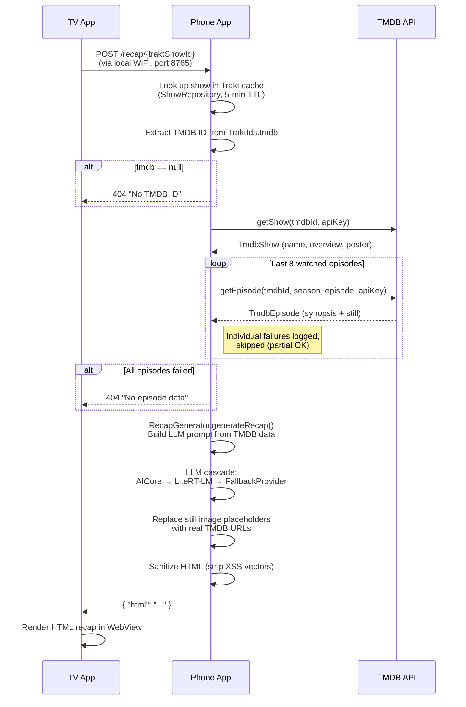
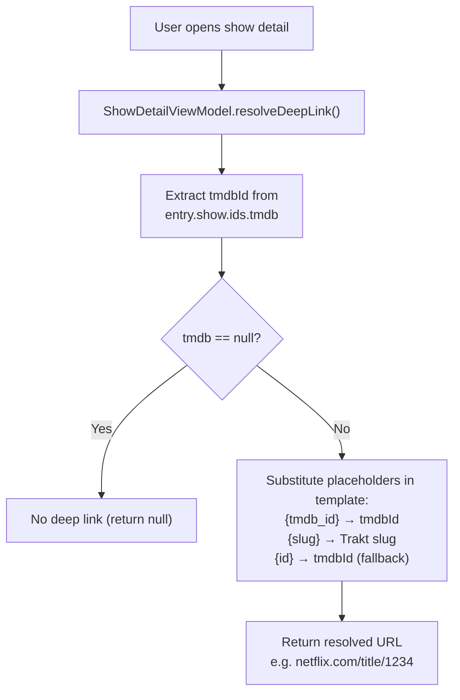
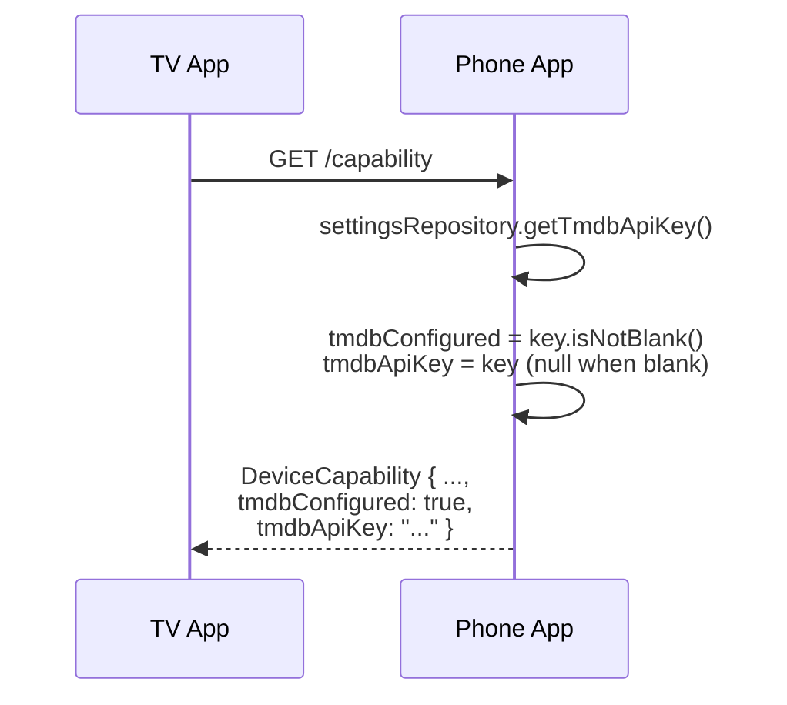
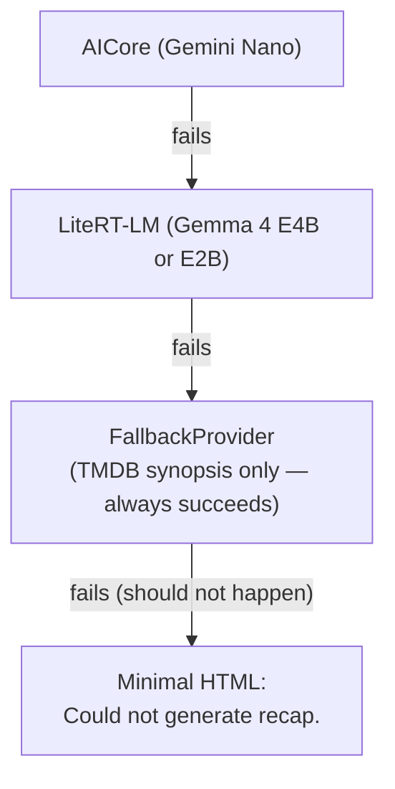

# WatchBuddy — TMDB Integration

This document describes how WatchBuddy uses [The Movie Database (TMDB)](https://www.themoviedb.org/) API, the user journeys it powers, and how connections and errors are handled.

---

## Overview

TMDB is a **secondary, enrichment-only** data source. All show discovery and watch tracking flows through [Trakt](https://trakt.tv/). TMDB provides:

- Episode synopses and metadata used to build AI-powered "Previously on..." recaps
- Episode still images embedded in recap slideshows
- Show posters and backdrops (available for future use)
- TMDB IDs used to construct deep links into streaming apps (Netflix, Disney+, etc.)

Unlike Trakt, which uses a shared backend token proxy, **TMDB uses per-user API keys** passed directly from the phone app — there is no server-side proxy.

---

## API Surface

All TMDB calls go through a single Retrofit interface defined in `core/src/main/java/com/justb81/watchbuddy/core/tmdb/TmdbApiService.kt`.

### Endpoints

| Method | Path | Parameters | Returns | Purpose |
|--------|------|------------|---------|---------|
| `getShow` | `GET /tv/{series_id}` | `series_id`, `api_key`, `language` | `TmdbShow` | Fetch show metadata (name, overview, poster, backdrop, air date) |
| `getEpisode` | `GET /tv/{series_id}/season/{season}/episode/{episode}` | `series_id`, `season_number`, `episode_number`, `api_key`, `language` | `TmdbEpisode` | Fetch single episode details (name, overview, still image, air date) |
| `searchTv` | `GET /search/tv` | `query`, `api_key`, `page` | `TmdbTvSearchResponse` | Search shows by title (used by TV scrobbler as Trakt-search fallback) |

`getShow` and `getEpisode` default to `language = "en-US"`. The language parameter follows TMDB's `xx-YY` format (ISO 639-1 language + ISO 3166-1 region). `searchTv` does not use a language parameter (search results are language-independent).

### Data Models

Defined in `core/src/main/java/com/justb81/watchbuddy/core/model/Models.kt`:

```kotlin
data class TmdbShow(
    val id: Int,                       // TMDB series ID
    val name: String,                  // Localized show title
    val overview: String? = null,      // Show description
    val poster_path: String? = null,   // Poster image path fragment
    val backdrop_path: String? = null, // Backdrop image path fragment
    val first_air_date: String? = null // ISO 8601 date
)

data class TmdbEpisode(
    val id: Int,                       // TMDB episode ID
    val name: String,                  // Localized episode title
    val overview: String? = null,      // Episode description / synopsis
    val still_path: String? = null,    // Episode still image path fragment
    val season_number: Int,
    val episode_number: Int,
    val air_date: String? = null       // ISO 8601 date
)
```

### Image URL Construction

TMDB returns **path fragments** (e.g. `/abc123.jpg`) for images. `TmdbImageHelper` in `TmdbApiService.kt` constructs full URLs:

```
https://image.tmdb.org/t/p/w{width}{path}
```

| Helper method | Default width | Example output |
|---------------|---------------|----------------|
| `TmdbImageHelper.still(path)` | 300 px | `https://image.tmdb.org/t/p/w300/abc123.jpg` |
| `TmdbImageHelper.poster(path)` | 500 px | `https://image.tmdb.org/t/p/w500/abc123.jpg` |
| `TmdbImageHelper.backdrop(path)` | 1280 px | `https://image.tmdb.org/t/p/w1280/abc123.jpg` |

All methods accept a custom `width` parameter and return `null` when the input path is `null`.

---

## Trakt-to-TMDB ID Mapping

For the recap and deep-link flows, TMDB is always queried by ID (not title) — the Trakt API provides a `tmdb` field inside its `TraktIds` object that serves as the bridge:

> **Exception:** The TV's `MediaSessionScrobbler` calls `searchTv(query)` by title when the local fuzzy-match cache returns no confident match. This is a title-based search solely for the purpose of identifying which show is being watched, not for metadata enrichment.

```kotlin
data class TraktIds(
    val trakt: Int? = null,
    val slug: String? = null,
    val tvdb: Int? = null,
    val imdb: String? = null,
    val tmdb: Int? = null    // ← used to call TMDB endpoints
)
```

When Trakt's `GET /sync/watched/shows` returns a user's watch history, each show entry includes `ids.tmdb`. This ID is used for all subsequent TMDB API calls. If `ids.tmdb` is `null` for a show, TMDB features (recaps, deep links) are unavailable for that show.

---

## User Journeys

### 1. Recap Generation (Primary TMDB Journey)

This is the main user journey that triggers TMDB API calls. It spans both devices.



**Key files involved:**
- `app-phone/…/server/CompanionHttpServer.kt` — HTTP endpoint, TMDB API calls
- `app-phone/…/llm/RecapGenerator.kt` — prompt building, image placeholder replacement
- `app-phone/…/llm/FallbackProvider.kt` — TMDB-only fallback when no LLM is available
- `app-phone/…/llm/LlmProviderFactory.kt` — cascade logic with TMDB fallback as last resort

#### TMDB Data in the LLM Prompt

The `RecapGenerator` builds a prompt containing:
- Show name (`TmdbShow.name`)
- Target episode identifier (`S02E04 "Episode Title"`)
- Last 8 watched episode summaries, each formatted as:
  ```
  S01E05 "Episode Name": <TMDB overview text>
  ```
- The LLM is instructed to use `` placeholders in its HTML output

After LLM inference, the regex `data-tmdb-still="S(\d+)E(\d+)"` matches these placeholders and replaces them with real `src="https://image.tmdb.org/t/p/w300/..."` URLs using `TmdbImageHelper.still()`.

#### TMDB-Only Fallback (No LLM)

When no LLM backend is available (AICore unavailable, insufficient RAM for LiteRT-LM), `FallbackProvider` generates a pure HTML slideshow directly from TMDB data:
- Takes the last 6 watched episodes
- Renders each episode's `name` and `overview` as a CSS-animated slide
- Uses `data-tmdb-still` placeholders (resolved later by `RecapGenerator`)
- No AI inference — just TMDB synopsis text displayed verbatim

### 2. Deep Link Resolution (TV App)

When the user views a show's detail screen on the TV, the app constructs deep links to streaming services using the TMDB ID.



**Deep link templates using `{tmdb_id}`:**

| Service | Template |
|---------|----------|
| Netflix | `https://www.netflix.com/title/{tmdb_id}` |
| Disney+ | `https://www.disneyplus.com/series/{slug}/{tmdb_id}` |
| Prime Video | `https://www.primevideo.com/search?phrase={slug}` (title-based search) |
| ARD Mediathek | `https://www.ardmediathek.de/video/{id}` (TMDB ID as fallback) |

Note: This journey does **not** call the TMDB API directly. It only uses the TMDB ID already present in the Trakt data model.

### 3. Device Capability Reporting

When the TV discovers a phone on the network, it calls `GET /capability`. The response includes the TMDB API key so the TV can call TMDB directly (for title search during scrobble matching and for show/movie data).



The TV uses `tmdbApiKey` for:
- Title search (`searchTv`) in `MediaSessionScrobbler` when the fuzzy cache match is below threshold
- Any other direct TMDB lookups the TV performs (show details, images)

---

## Connection and Network Handling

### HTTP Client Configuration

TMDB shares the core `OkHttpClient` with Trakt, configured in `core/…/network/NetworkModule.kt`:

| Setting | Value | Notes |
|---------|-------|-------|
| Base URL | `https://api.themoviedb.org/3/` | Dedicated Retrofit instance (`@Named("tmdb")`) |
| Certificate pinning | Let's Encrypt R3 + ISRG Root X1 for `api.themoviedb.org` | Intermediate CA pins for resilience during leaf cert rotation |
| JSON parser | kotlinx.serialization with `ignoreUnknownKeys = true`, `isLenient = true`, `coerceInputValues = true` | Graceful handling of API changes and unexpected fields |
| Logging | `HttpLoggingInterceptor.Level.BODY` in debug, `NONE` in release | |
| Timeouts | OkHttp defaults (10 s connect, 10 s read, 10 s write) | |

Note: The shared OkHttpClient also adds Trakt-specific headers (`trakt-api-version: 2`, `Content-Type: application/json`). These extra headers are harmless for TMDB requests since TMDB ignores unknown headers.

### API Key Management

TMDB does **not** use a backend proxy. Each user provides their own API key:

1. **Storage:** Android DataStore (Preferences), key `tmdb_api_key`
   - Managed by `SettingsRepository` in `app-phone/…/settings/SettingsRepository.kt`
   - Part of the `AppSettings` data class
2. **Entry point:** User enters the key in Advanced Settings on the phone app
3. **Injection:** Passed as `@Query("api_key")` on every TMDB request — not stored in headers or interceptors
4. **Override:** The TV can optionally send a `tmdbApiKey` field in the `POST /recap` request body, which takes priority over the stored key

```kotlin
// CompanionHttpServer.kt — API key resolution
val apiKey = body.tmdbApiKey.ifBlank {
    settingsRepository.getTmdbApiKey().first()
}
```

### Error Handling and Fallback Chain

TMDB errors are handled at multiple levels:

#### 1. Individual Episode Fetch Failures

```kotlin
// CompanionHttpServer.kt — partial failure is acceptable
tmdbApiService.getEpisode(tmdbId, season, episode, apiKey)
// catch → Log.w(...), return null
// mapNotNull filters out failed episodes
```

If some episodes fail but others succeed, the recap proceeds with the available episodes.

#### 2. Complete TMDB Failure

| Condition | Response |
|-----------|----------|
| `TraktIds.tmdb` is `null` | HTTP 404 — "No TMDB ID for show" |
| All episode fetches fail | HTTP 404 — "No episode data available" |
| `getShow()` throws | HTTP 503 — "Recap generation failed" (caught by outer try/catch) |

#### 3. LLM Cascade with TMDB Fallback

Even when TMDB data is successfully fetched, the LLM may fail. The cascade:



The `FallbackProvider` is the safety net: it constructs a slideshow purely from TMDB episode overviews and still images without any LLM inference, guaranteeing that if TMDB data was fetched successfully, the user always gets a recap.

### Caching Strategy

| Layer | What is cached | TTL | Storage |
|-------|---------------|-----|---------|
| `ShowRepository` (phone) | `List<TraktWatchedEntry>` from Trakt (contains TMDB IDs) | 5 minutes | In-memory |
| `TvShowCache` (TV) | Show list for local fuzzy-matching | App lifetime (no TTL) | In-memory (volatile) |
| `TmdbCache` (phone) | `TmdbShow` and `TmdbEpisode` responses | 15 minutes | In-memory |

`TmdbCache` is a `@Singleton` that caches `getShow` and `getEpisode` responses for 15 minutes. Repeated recap requests for the same show (e.g. after watching another episode) reuse cached data instead of hitting the TMDB API again. This reduces latency and helps stay within TMDB's rate limits.

### Localization

TMDB API calls include a `language` parameter (default `"de-DE"`). This controls the language of returned metadata (show names, episode overviews, etc.).

Separately, `LocaleHelper.getLlmResponseLanguage()` reads the device's system locale and passes its English name (e.g. "German", "French") to the LLM prompt, so the generated recap text matches the user's language — independent of the TMDB response language.

---

## Module Responsibility Summary

| Module | File | TMDB Role |
|--------|------|-----------|
| **core** | `tmdb/TmdbApiService.kt` | Retrofit interface (`getShow`, `getEpisode`, `searchTv`), response DTOs, `TmdbImageHelper` |
| **core** | `model/Models.kt` | `TmdbShow`, `TmdbEpisode`, `TmdbTvSearchResponse` data classes; `TraktIds.tmdb` mapping; `KNOWN_STREAMING_SERVICES` with `{tmdb_id}` templates |
| **core** | `network/NetworkModule.kt` | OkHttpClient with cert pinning, TMDB Retrofit instance, Hilt DI |
| **app-phone** | `server/CompanionHttpServer.kt` | Recap endpoint: calls `getShow()` + `getEpisode()`, passes data to `RecapGenerator` |
| **app-phone** | `llm/RecapGenerator.kt` | Builds LLM prompt from TMDB data, replaces still image placeholders |
| **app-phone** | `llm/FallbackProvider.kt` | Generates HTML recap from TMDB synopses alone (no LLM) |
| **app-phone** | `llm/LlmProviderFactory.kt` | Cascade with `FallbackProvider` (TMDB-only) as last resort |
| **app-phone** | `server/DeviceCapabilityProvider.kt` | Exposes `tmdbConfigured` flag and `tmdbApiKey` to TV via `/capability` |
| **app-phone** | `settings/SettingsRepository.kt` | Stores and retrieves user's TMDB API key |
| **app-phone** | `ui/home/HomeViewModel.kt` | Loads TMDB posters for each show in the library (parallel `getShow()` calls after sync) |
| **app-phone** | `ui/showdetail/ShowDetailViewModel.kt` | Loads TMDB poster + overview for a single show's detail screen |
| **app-tv** | `ui/showdetail/ShowDetailViewModel.kt` | Substitutes `{tmdb_id}` in streaming deep link templates |
| **app-tv** | `scrobbler/MediaSessionScrobbler.kt` | Uses `searchTv()` as fallback when fuzzy-matching media titles against the local show cache |

---

## Security Considerations

- **API key scope:** TMDB API keys are read-only by default (TMDB v3 uses a single API key for read access). No write operations are performed.
- **HTML sanitization:** LLM-generated HTML containing TMDB data is sanitized before rendering in WebView — `<script>`, `<iframe>`, `on*` event handlers, and `javascript:` URLs are stripped (`RecapGenerator.sanitizeHtml()`).
- **Certificate pinning:** TMDB API connections are pinned to Let's Encrypt intermediate CA certificates, preventing MITM attacks even if a rogue CA is trusted by the device.
- **TMDB key exposure to TV:** The TMDB API key is sent from the phone to the TV as part of the `GET /capability` response (`DeviceCapability.tmdbApiKey`). This is intentional — the TV needs the key to call TMDB directly for title search (scrobble matching) and show data. Both devices are on the same trusted local WiFi network. Users should treat the phone–TV link as a trusted local connection.
