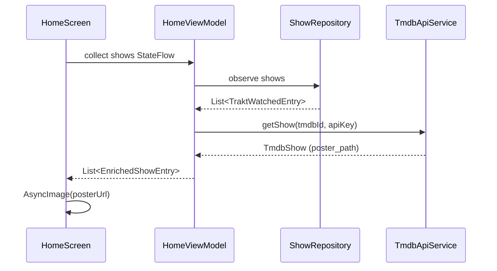
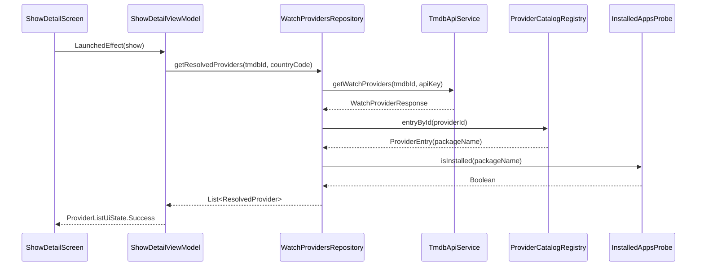
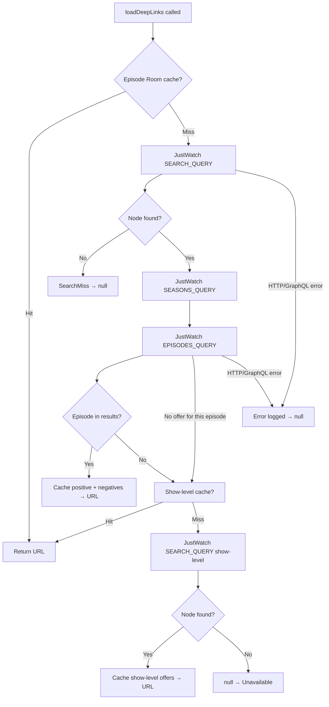
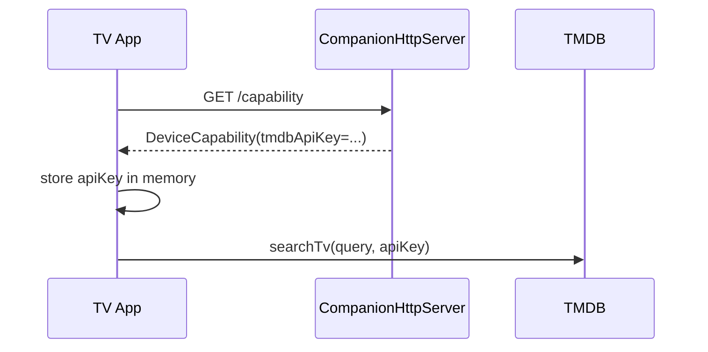
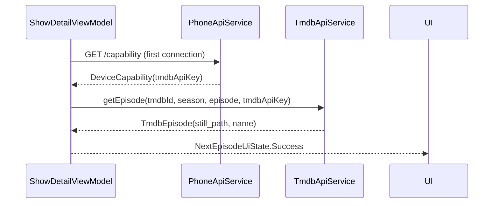
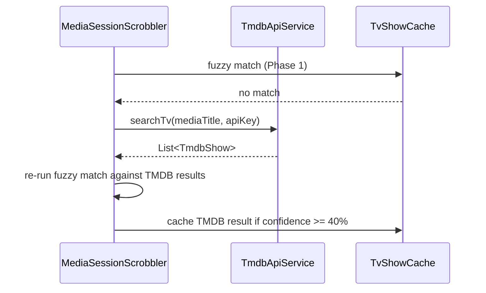

# WatchBuddy — TMDB Integration

This document describes how WatchBuddy uses [The Movie Database (TMDB)](https://www.themoviedb.org/) API, the user journeys it powers, and how connections and errors are handled.

---

## Overview

TMDB is a **secondary, enrichment-only** data source. All show discovery and watch tracking flows through [Trakt](https://trakt.tv/). TMDB provides:

- Episode synopses and metadata used to build AI-powered "Previously on..." recaps
- Episode still images embedded in recap slideshows
- Show posters and backdrops (available for future use)
- TMDB IDs used to construct deep links into streaming apps (Netflix, Disney+, etc.)

Unlike Trakt, which uses a shared backend token proxy, **TMDB uses per-user API keys** passed directly from the phone app — there is no server-side proxy.

---

## API Surface

All TMDB calls go through a single Retrofit interface defined in `core/src/main/java/com/justb81/watchbuddy/core/tmdb/TmdbApiService.kt`.

### Endpoints

| Method | Path | Parameters | Returns | Purpose |
|--------|------|------------|---------|--------|
| `getShow` | `GET /tv/{series_id}` | `series_id`, `api_key`, `language` | `TmdbShow` | Fetch show metadata (name, overview, poster, backdrop, air date) |
| `getEpisode` | `GET /tv/{series_id}/season/{season}/episode/{episode}` | `series_id`, `season_number`, `episode_number`, `api_key`, `language` | `TmdbEpisode` | Fetch single episode details (name, overview, still image, air date) |
| `searchTv` | `GET /search/tv` | `query`, `api_key`, `page` | `TmdbTvSearchResponse` | Search shows by title (used by TV scrobbler as Trakt-search fallback) |
| `getWatchProviders` | `GET /tv/{series_id}/watch/providers` | `series_id`, `api_key` | `WatchProviderResponse` | Fetch per-region streaming availability (flatrate, ads, free) for "Available on" row |

`getShow` and `getEpisode` default to `language = "en-US"`. The language parameter follows TMDB's `xx-YY` format (ISO 639-1 language + ISO 3166-1 region). `searchTv` does not use a language parameter (search results are language-independent).

### Data Models

Defined in `core/src/main/java/com/justb81/watchbuddy/core/model/Models.kt`:

```kotlin
data class TmdbShow(
    val id: Int,                       // TMDB series ID
    val name: String,                  // Localized show title
    val overview: String? = null,      // Show description
    val poster_path: String? = null,   // Poster image path fragment
    val backdrop_path: String? = null, // Backdrop image path fragment
    val first_air_date: String? = null // ISO 8601 date
)

data class TmdbEpisode(
    val id: Int,                       // TMDB episode ID
    val name: String,                  // Episode title
    val overview: String? = null,      // Episode synopsis
    val still_path: String? = null,    // Still image path fragment
    val season_number: Int,
    val episode_number: Int,
    val air_date: String? = null
)
```

---

## Image Handling

TMDB images are referenced by a path fragment (e.g. `/abc123.jpg`). The full URL is constructed by prepending the TMDB image base URL:

```
https://image.tmdb.org/t/p/{size}{path_fragment}
```

Common sizes used in WatchBuddy:

| Size | Usage |
|------|-------|
| `w185` | Provider logos (small) |
| `w342` | Show posters (medium) |
| `w780` | Episode stills (large) |
| `original` | Full-resolution backdrops |

Image loading uses [Coil](https://coil-kt.github.io/coil/) with a `crossfade(true)` transition. Placeholder and error drawables are set per call site.

`TmdbImageHelper.logo(logoPath: String?)` in `core/tmdb/` constructs the full provider logo URL using `w185`.

---

## User Journeys

### 1. Phone Home Screen — Show List with Posters (#248)

When the phone app opens `HomeScreen`, `HomeViewModel` loads the user's Trakt watchlist and enriches each entry with TMDB poster data.


```mermaid
sequenceDiagram
    participant UI as HomeScreen
    participant VM as HomeViewModel
    participant Show as ShowRepository
    participant TMDB as TmdbApiService

    UI->>VM: collect shows StateFlow
    VM->>Show: observe shows
    Show-->>VM: List<TraktWatchedEntry>
    VM->>TMDB: getShow(tmdbId, apiKey)
    TMDB-->>VM: TmdbShow (poster_path)
    VM-->>UI: List<EnrichedShowEntry>
    UI->>UI: AsyncImage(posterUrl)
```

**Error handling:** If `getShow` fails (network error or 404), the entry is shown without a poster. No retry is attempted for individual show failures; the whole list refreshes on the next `HomeViewModel` lifecycle start.

### 2. TV ShowDetail — Watch Providers (#311)

When the TV user opens a show, `ShowDetailViewModel` fetches streaming providers from TMDB, cross-references them with the installed-app registry, and ranks them by last-used status.


```mermaid
sequenceDiagram
    participant UI as ShowDetailScreen
    participant VM as ShowDetailViewModel
    participant WP as WatchProvidersRepository
    participant TMDB as TmdbApiService
    participant Registry as ProviderCatalogRegistry
    participant Probe as InstalledAppsProbe

    UI->>VM: LaunchedEffect(show)
    VM->>WP: getResolvedProviders(tmdbId, countryCode)
    WP->>TMDB: getWatchProviders(tmdbId, apiKey)
    TMDB-->>WP: WatchProviderResponse
    WP->>Registry: entryById(providerId)
    Registry-->>WP: ProviderEntry(packageName)
    WP->>Probe: isInstalled(packageName)
    Probe-->>WP: Boolean
    WP-->>VM: List<ResolvedProvider>
    VM-->>UI: ProviderListUiState.Success
```

**Error handling:** If `getWatchProviders` fails, `ProviderListUiState.Error` is emitted and a retry button is shown. The 24-hour in-memory cache is bypassed on retry.

### 2b. TV ShowDetail — JustWatch per-episode deep links (#418)

When the provider list is loaded, `ShowDetailViewModel` additionally resolves per-episode streaming URLs from JustWatch.


```mermaid
flowchart TD
    A[loadDeepLinks called] --> B{Episode Room cache?}
    B -->|Hit| C[Return URL]
    B -->|Miss| D[JustWatch SEARCH_QUERY]
    D --> E{Node found?}
    E -->|No| F[SearchMiss → null]
    E -->|Yes| G[JustWatch SEASONS_QUERY]
    G --> H[JustWatch EPISODES_QUERY]
    H --> I{Episode in results?}
    I -->|Yes| J[Cache positive + negatives → URL]
    I -->|No| K[Show-level cache?]
    K -->|Hit| C
    K -->|Miss| L[JustWatch SEARCH_QUERY show-level]
    L --> M{Node found?}
    M -->|Yes| N[Cache show-level offers → URL]
    M -->|No| O[null → Unavailable]
    H -->|No offer for this episode| K
    D -->|HTTP/GraphQL error| P[Error logged → null]
    H -->|HTTP/GraphQL error| P
```

`ProviderCatalogRegistry` maps TMDB `provider_id` integers to Android package names so deep links can be
attributed to the correct app. JustWatch `technicalName` strings (e.g. `netflix`, `amazonprime`, `disneyplus`) are
translated to TMDB `provider_id` integers via `ProviderCatalogRegistry.providerIdByJustWatchName()`.

Note: This journey calls the JustWatch GraphQL API, not the TMDB API. TMDB data (the TMDB show ID
and the episode numbers from `ShowProgressCalculator`) is used as input to the JustWatch query.

### 3. Device Capability Reporting

When the TV discovers a phone on the network, it calls `GET /capability`. The response includes the TMDB API key so the TV can call TMDB directly (for title search during scrobble matching and for show/movie data).


```mermaid
sequenceDiagram
    participant TV as TV App
    participant Phone as CompanionHttpServer

    TV->>Phone: GET /capability
    Phone-->>TV: DeviceCapability(tmdbApiKey=...)
    TV->>TV: store apiKey in memory
    TV->>TMDB: searchTv(query, apiKey)
```

The TMDB API key is held in TV process memory only and is never persisted to disk.

### 4. TV ShowDetail — Watch Providers: Installed App Filter and Ordering

`WatchProvidersRepository.getResolvedProviders()` applies three layers of filtering and ordering:

1. **Package name lookup**: `ProviderCatalogRegistry.entryById(providerId)?.packageName`
2. **Installed check**: `InstalledAppsProbe.isInstalled(packageName)`
3. **Last-used ordering**: `LastUsedProviderRepository` provides a per-show `providerId`; the matching entry is sorted first

**Key files:**
- `app-tv/…/data/WatchProvidersRepository.kt` — fetch, 24 h in-memory cache, ordering
- `app-tv/…/data/LastUsedProviderRepository.kt` — TV-local DataStore, `Map<tmdbId, providerId>`
- `app-tv/…/discovery/InstalledAppsProbe.kt` — `PackageManager` cache, invalidated on install/remove
- `core/…/deeplink/ProviderCatalogRegistry.kt` — TMDB `provider_id` → package name + JustWatch `technicalName` → provider_id (for `InstalledAppsProbe` + `<queries>` manifest)
- `app-tv/AndroidManifest.xml` — `<queries>` block for Android 11+ package visibility

### 5. TV ShowDetail — Next-Episode Still Image and Title (#366)

When the user opens a show on the TV `ShowDetailScreen`, `ShowDetailViewModel.loadNextEpisode()` fetches the next unwatched episode's still image and title directly from TMDB (using the phone's API key).


```mermaid
sequenceDiagram
    participant VM as ShowDetailViewModel
    participant Phone as PhoneApiService
    participant TMDB as TmdbApiService

    VM->>Phone: GET /capability (first connection)
    Phone-->>VM: DeviceCapability(tmdbApiKey)
    VM->>TMDB: getEpisode(tmdbId, season, episode, tmdbApiKey)
    TMDB-->>VM: TmdbEpisode(still_path, name)
    VM-->>UI: NextEpisodeUiState.Success
```

**Error handling:** If `getEpisode` fails, `NextEpisodeUiState.Error` is emitted. The UI shows the show title without a still image.

### 6. TV Scrobbler — Title Search Fallback (#354)

When the scrobbler's Phase 1 (library match) fails, Phase 2 calls `TmdbApiService.searchTv()` to find a TMDB match.


```mermaid
sequenceDiagram
    participant Scrobbler as MediaSessionScrobbler
    participant TMDB as TmdbApiService
    participant Cache as TvShowCache

    Scrobbler->>Cache: fuzzy match (Phase 1)
    Cache-->>Scrobbler: no match
    Scrobbler->>TMDB: searchTv(mediaTitle, apiKey)
    TMDB-->>Scrobbler: List<TmdbShow>
    Scrobbler->>Scrobbler: re-run fuzzy match against TMDB results
    Scrobbler->>Cache: cache TMDB result if confidence >= 40%
```

**Error handling:** If `searchTv` fails, Phase 2 is skipped and Phase 3 (LLM title extraction) is attempted. No error is surfaced to the user.

---

## Connection Handling

### API Key

The TMDB API key is entered once during phone onboarding and stored encrypted in `EncryptedSharedPreferences` via `AppSettings`. It is included as the `api_key` query parameter in every TMDB request. The TV receives the key via `GET /capability` and holds it in memory.

### Timeouts and Retry

All TMDB calls use a shared `OkHttpClient` configured in `NetworkModule`:

| Timeout type | Value |
|-------------|-------|
| Connect | 10 s |
| Read | 15 s |
| Write | 10 s |

No automatic retry is configured at the OkHttp layer. Call sites handle failures individually (see Error Handling sections above).

### Rate Limiting

TMDB enforces a rate limit of 40 requests per 10 seconds per IP. WatchBuddy does not implement explicit rate-limiting logic — it relies on the low request volume (one show per card render, one episode per show detail open) staying well within the limit for typical use.

---

## Error Handling Summary

| Journey | Error condition | Handling |
|---------|----------------|----------|
| Home: poster | `getShow` fails | No poster shown; entry still displayed |
| TV ShowDetail: providers | `getWatchProviders` fails | `ProviderListUiState.Error` + retry button |
| TV ShowDetail: deep links | JustWatch search miss | `DeepLinkState.Unavailable` chip disabled |
| TV ShowDetail: deep links | Network/HTTP error | No negative cached; next visit retries |
| TV ShowDetail: next-episode | `getEpisode` fails | `NextEpisodeUiState.Error`; no still shown |
| TV scrobbler: title search | `searchTv` fails | Phase 2 skipped; proceeds to Phase 3 (LLM) |

---

## Caching

| Data | Cache location | TTL | Invalidation |
|------|----------------|-----|--------------|
| Watch providers | In-memory (`WatchProvidersRepository`) | 24 h | App restart |
| TMDB show metadata | In-memory (`TvShowCache`) | Session | App restart |
| JustWatch deep links | Room DB (`justwatch_deep_links.db`) | Positive: permanent; Negative: 30 d | Manual clear in Diagnostics |
| Provider catalog | Room DB (`ProviderCatalogCacheDao`) | Until next phone connection | `TvProviderCatalogRepository` refresh |

---

## TMDB API Key Management

| Location | Storage | Lifetime |
|----------|---------|----------|
| Phone app | `EncryptedSharedPreferences` (Android Keystore) | Persistent |
| TV app (in memory) | Kotlin `var` in `PhoneDiscoveryManager` | Session only |
| TV app (BLE/HTTP transport) | Included in `/capability` JSON | Per-poll |

The key is never logged, never written to disk on the TV, and never included in crash reports.

---

## Implementation Files by Journey

| Module | File | Role |
|--------|------|------|
| **app-phone** | `ui/home/HomeViewModel.kt` | Enriches Trakt watchlist with TMDB poster paths |
| **app-phone** | `server/ShowRepository.kt` | Reactive `shows` StateFlow; lazy TMDB enrichment |
| **app-tv** | `ui/showdetail/ShowDetailViewModel.kt` | Loads providers via `WatchProvidersRepository`, records last-used on tap, resolves per-episode deep links via `JustWatchDeepLinkRepository` |
| **app-tv** | `data/WatchProvidersRepository.kt` | Calls `getWatchProviders()`, caches 24 h, composes installed/last-used ordered list |
| **app-tv** | `data/LastUsedProviderRepository.kt` | TV-local DataStore — tracks most-recently used `provider_id` per show |
| **app-tv** | `discovery/InstalledAppsProbe.kt` | `PackageManager` cache — reports which streaming apps are installed |
| **core** | `deeplink/ProviderCatalogRegistry.kt` | Maps TMDB `provider_id` → Android package name and JustWatch `technicalName` → `provider_id` (single registry; no deep-link templates) |
| **app-tv** | `scrobbler/MediaSessionScrobbler.kt` | Uses `searchTv()` as fallback when fuzzy-matching media titles against the local show cache |

---

## Security Considerations

- The TMDB API key is a **personal key** entered by the user. It is not a shared app secret.
- The key is stored in Android Keystore-backed `EncryptedSharedPreferences` on the phone.
- The key is transmitted over the local Wi-Fi network (unencrypted HTTP) between phone and TV. This is acceptable for a local-network protocol.
- The key is never sent to the backend token proxy, to Trakt, or to any third party.
- TMDB does not expose personally identifiable information (PII) in its API responses.
