# Trakt Connection and Sync — Complete Flow Documentation

> **Trakt API reference:** https://github.com/trakt/trakt-api — the official API repository with ts-rest contract definitions. Do not use the outdated Apiary docs (`trakt.docs.apiary.io`).

This document describes the full user journey and technical flow for connecting to Trakt, syncing watch history, and scrobbling — covering both the phone and TV apps end to end.

---

## Table of Contents

1. [High-Level Overview](#high-level-overview)
2. [Phase 1: Authentication (Phone)](#phase-1-authentication-phone)
3. [Phase 2: Phone Companion Server](#phase-2-phone-companion-server)
4. [Phase 3: TV Discovery](#phase-3-tv-discovery)
5. [Phase 4: Show Sync](#phase-4-show-sync)
6. [Phase 5: Scrobbling](#phase-5-scrobbling)
7. [Phase 6: Deep Linking](#phase-6-deep-linking)
8. [Authentication Modes](#authentication-modes)
9. [Token Lifecycle](#token-lifecycle)
10. [Key Thresholds and Constants](#key-thresholds-and-constants)
11. [Sequence Diagrams](#sequence-diagrams)
12. [File Reference](#file-reference)

---

## High-Level Overview

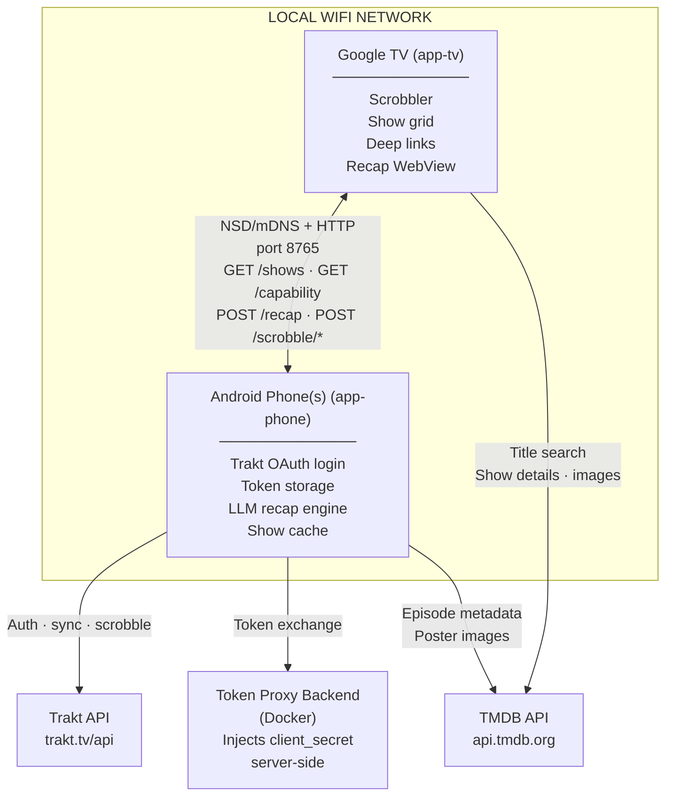

The phone app owns the Trakt connection. The TV app has **no Trakt credentials** — it discovers phones on the local network and uses each phone's HTTP API for all Trakt-related operations (scrobbling, show library). The TV calls TMDB directly for show metadata and title search, using the API key obtained from the phone's `/capability` endpoint.

---

## Phase 1: Authentication (Phone)

### User Journey

1. User launches the phone app for the first time and reaches the **Onboarding screen**.
2. User taps **"Connect to Trakt"**.
3. The app displays a short alphanumeric **user code** and a countdown timer.
4. User opens a browser, navigates to `https://trakt.tv/activate`, and enters the code.
5. User authorizes WatchBuddy on the Trakt website.
6. The app detects the authorization (via polling) and shows "Connected as **{username}**".

### Technical Flow

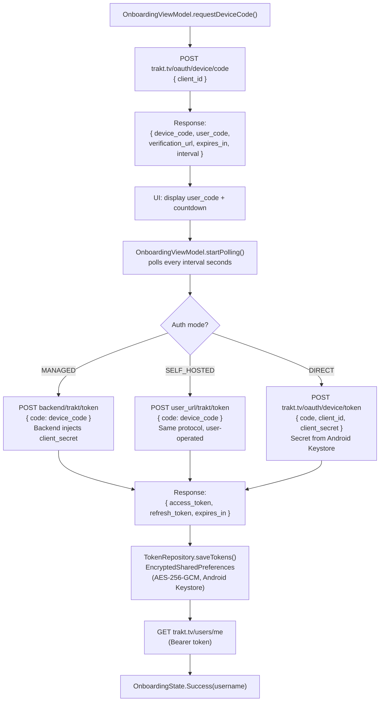

### Key Classes

| Class | Responsibility |
|-------|----------------|
| `OnboardingViewModel` | Drives the OAuth device flow, polls for token |
| `TokenRepository` | Encrypted token storage (Keystore-backed) |
| `TraktApiService` | Retrofit client for Trakt API |
| `TokenProxyService` | Retrofit client for backend token proxy |
| `NetworkModule` | Provides OkHttp + Retrofit instances with cert pinning |

---

## Phase 2: Phone Companion Server

### User Journey

1. After Trakt login, user enables the **Companion Service** in Settings.
2. The phone starts a foreground service with a persistent notification.
3. The phone is now discoverable by TV apps on the same Wi-Fi network.

### Technical Flow

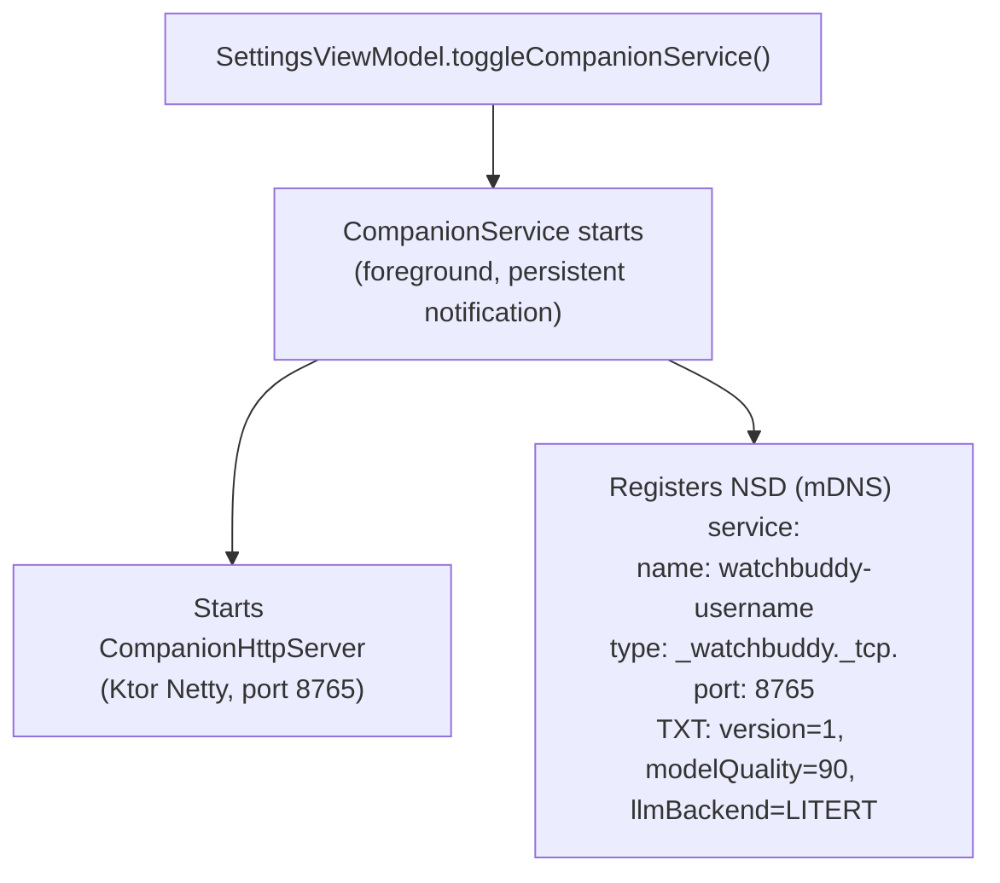

### HTTP Endpoints (Phone Serves)

| Method | Path | Description | Auth |
|--------|------|-------------|------|
| `GET` | `/capability` | Device info, LLM backend, RAM, model quality score, TMDB API key | No |
| `GET` | `/shows` | User's Trakt watched shows (5-min cache) | Token required |
| `POST` | `/recap/{traktShowId}` | Generate HTML recap via LLM | Token required |
| `GET` | `/auth/token` | Return current Trakt access token | Token required |
| `POST` | `/scrobble/start` | Forward scrobble start to Trakt | Token required |
| `POST` | `/scrobble/pause` | Forward scrobble pause to Trakt | Token required |
| `POST` | `/scrobble/stop` | Forward scrobble stop to Trakt | Token required |

---

## Phase 3: TV Discovery

### User Journey

1. User launches the TV app on Google TV.
2. The TV automatically discovers phone(s) on the network.
3. The TV home screen shows a connection badge ("1 phone connected — Pixel 8 Pro").
4. No Trakt login required on the TV — all Trakt operations are proxied through the phone's HTTP API.

### Technical Flow

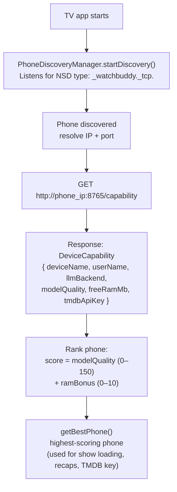

RAM bonus calculation: ≥ 6 GB → +10 | 4–6 GB → +6 | 3–4 GB → +3 | < 3 GB → 0

### Key Classes

| Class | Responsibility |
|-------|----------------|
| `PhoneDiscoveryManager` | NSD listener, phone ranking, best-phone selection |
| `PhoneApiService` | Retrofit interface for phone HTTP endpoints |
| `PhoneApiClientFactory` | Creates per-phone Retrofit clients (cached by base URL) |

---

## Phase 4: Show Sync

### User Journey

1. The TV home screen loads automatically once a phone is connected.
2. User sees a grid of show cards with poster art, title, and the last watched episode ("S03E07").
3. If the phone is temporarily unreachable, the TV falls back to its local cache.

### Technical Flow

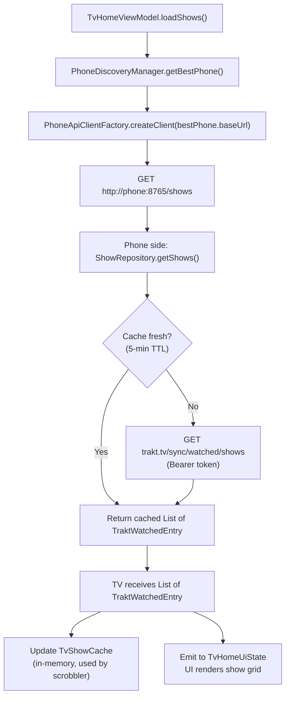

### Failover Chain

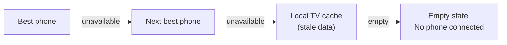

---

## Phase 5: Scrobbling

### User Journey

1. User opens a streaming app (Netflix, Disney+, etc.) on the TV and starts watching a show.
2. **Auto-scrobble (≥ 95% confidence):** The episode is silently reported to Trakt via the phone — no UI interruption.
3. **Confirmation overlay (70–95%):** A small overlay appears in the bottom-right corner: "Watching Breaking Bad S01E03?" with Yes/No buttons. Auto-confirms after 15 seconds.
4. **Below 70%:** Ignored entirely — no UI, no scrobble.
5. When the user pauses, the scrobble state updates. When playback stops, the episode is marked as watched on Trakt.

### Technical Flow

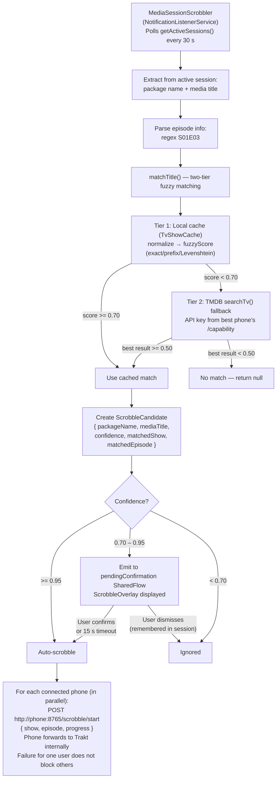

**Playback state changes** (each fires for ALL connected phones in parallel via their `/scrobble/*` endpoints):

| State | Phone endpoint | Progress | Effect |
|-------|---------------|----------|--------|
| PLAYING | `POST /scrobble/start` | Real playback progress (0–100), else 0.0 | Start watching |
| PAUSED | `POST /scrobble/pause` | Real playback progress (0–100), else 50.0 | Pause |
| STOPPED | `POST /scrobble/stop` | Real playback progress (0–100) — event **skipped** if unavailable | Marks episode as watched only if `progress >= 80` (Trakt rule) |

Progress is derived from `PlaybackState.position` and `MediaMetadata.METADATA_KEY_DURATION`. When the media session does not expose either value (e.g. live TV), `start` and `pause` fall back to their historical fixed values so tracking is not lost, but `stop` is skipped entirely to avoid Trakt accidentally marking an unfinished episode as watched.

### Key Classes

| Class | Responsibility |
|-------|----------------|
| `MediaSessionScrobbler` | Polls media sessions, fuzzy matches, scrobbles via phone HTTP API for all connected users |
| `TvShowCache` | In-memory show cache for first-pass matching |
| `ScrobbleViewModel` | Bridges pending confirmations to the overlay UI |
| `ScrobbleOverlay` | Composable confirmation overlay (D-pad navigable) |

---

## Phase 6: Deep Linking

### User Journey

1. From the TV home grid, user selects a show card.
2. The **Show Detail screen** appears with poster, synopsis, and a "Watch Now" button.
3. User taps "Watch Now" — the correct streaming app launches directly to the show.

### Technical Flow

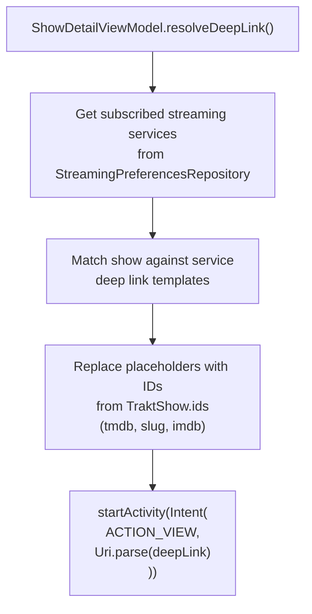

**Deep link templates:**

| Service | Template |
|---------|----------|
| Netflix | `https://www.netflix.com/title/{tmdb_id}` |
| Prime Video | `https://www.primevideo.com/search?phrase={slug}` |
| Disney+ | `https://www.disneyplus.com/series/{slug}/{tmdb_id}` |
| WaipuTV | `waipu://tv` |
| Joyn | `https://www.joyn.de/serien/{slug}` |
| ARD | `https://www.ardmediathek.de/video/{id}` |
| ZDF | `https://www.zdf.de/serien/{slug}` |

---

## Authentication Modes

WatchBuddy supports three authentication modes, configurable in Advanced Settings on the phone app.

### 1. Managed (Default)

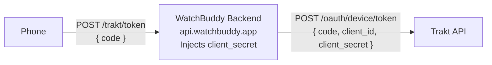

- **Setup:** No configuration needed (works out of the box).
- **Security:** The Trakt `client_secret` never leaves the backend server. The APK contains only the public `client_id`.
- **Backend:** Node.js + Express, rate-limited (60 req/min per IP), token validation via regex and length limits.

### 2. Self-Hosted

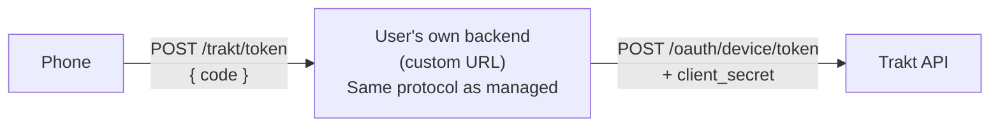

- **Setup:** User enters their backend URL in Advanced Settings.
- **Security:** Same proxy protocol — secret stays on the user's server.
- **Use case:** Users who want full control over their infrastructure.

### 3. Direct

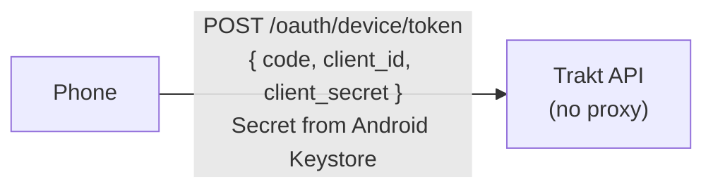

- **Setup:** User enters their own Trakt app `client_id` and `client_secret` in Advanced Settings.
- **Security:** Secret is stored in Android Keystore (hardware-backed, AES-256-GCM encrypted).
- **Use case:** Developers or users who register their own Trakt API application.

### Resolution Logic

```kotlin
fun resolveClientId(authMode, backendUrl, directClientId): String? = when (authMode) {
    MANAGED     → buildConfigClientId if non-blank AND tokenProxy != null
    SELF_HOSTED → buildConfigClientId if non-blank AND backendUrl non-blank
    DIRECT      → directClientId if non-blank AND clientSecret non-blank
}
// Returns null → OnboardingState.NotConfigured (shows setup instructions)
```

---

## Token Lifecycle

### Storage

| Item | Storage | Encryption |
|------|---------|------------|
| `access_token` | EncryptedSharedPreferences | AES-256-GCM (Keystore master key) |
| `refresh_token` | EncryptedSharedPreferences | AES-256-GCM (Keystore master key) |
| `expires_at` | EncryptedSharedPreferences | AES-256-GCM (Keystore master key) |
| `trakt_client_secret` (DIRECT mode) | EncryptedSharedPreferences | AES-256-GCM (Keystore master key) |

### Token Flow Across Devices

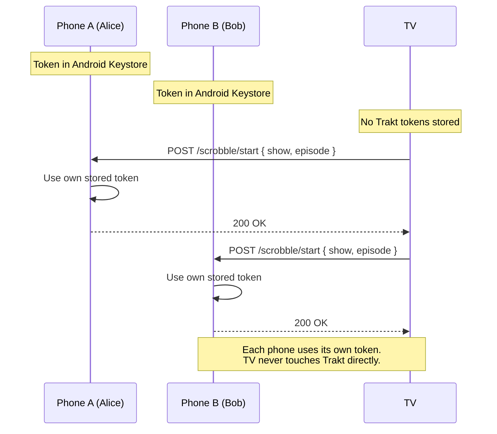

The TV has **no Trakt tokens**. All Trakt operations are proxied through each phone's HTTP API endpoints (`/scrobble/*`, `/shows`). Each phone uses its own stored credentials to call Trakt on behalf of its user.

### Refresh

The `TraktApiService` and `TokenProxyService` both define refresh endpoints (`POST /oauth/token` and `POST /trakt/token/refresh`), but automated refresh-on-expiry is not yet wired up. When a token expires, the user must re-authenticate through the onboarding flow.

---

## Key Thresholds and Constants

| Constant | Value | Location |
|----------|-------|----------|
| Scrobble auto-confirm threshold | >= 0.95 | `MediaSessionScrobbler` |
| Scrobble overlay threshold | 0.70 – 0.95 | `MediaSessionScrobbler` |
| Scrobble ignore threshold | < 0.70 | `MediaSessionScrobbler` |
| TMDB search fallback threshold | >= 0.50 | `MediaSessionScrobbler` |
| Overlay auto-dismiss timeout | 15 seconds | `ScrobbleOverlay` |
| Media session poll interval | 30 seconds | `MediaSessionScrobbler` |
| Phone show cache TTL | 5 minutes | `ShowRepository` |
| Companion server port | 8765 | `CompanionHttpServer` |
| NSD service type | `_watchbuddy._tcp.` | `CompanionService` |
| Backend rate limit | 60 req/min per IP | `backend/src/app.js` |
| Recap episode context | Last 8 episodes | `RecapGenerator` |

---

## Sequence Diagrams

### Full Authentication Sequence

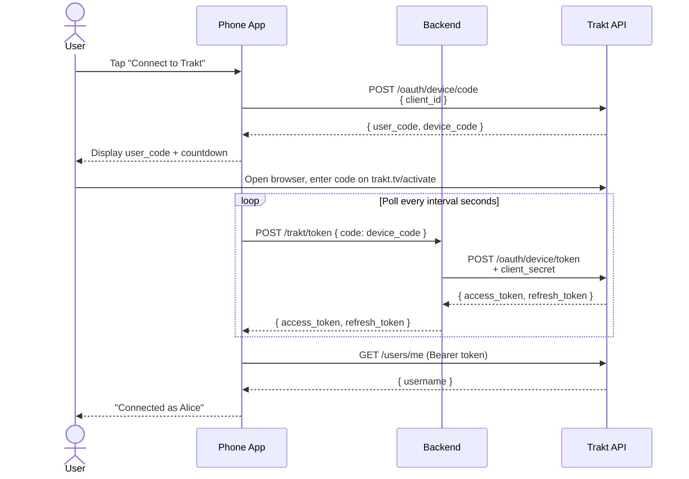

### Full Scrobble Sequence (multi-user)

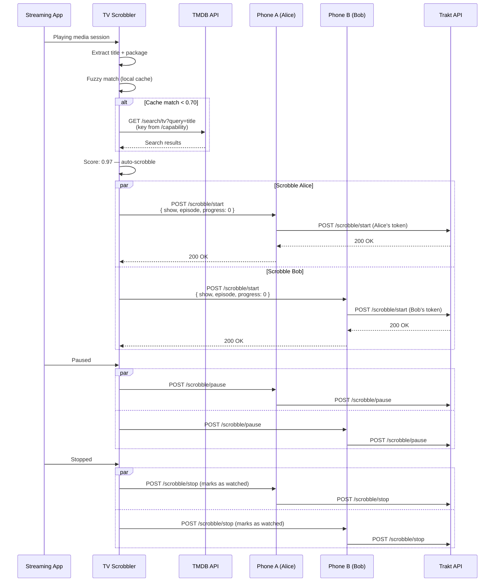

---

## File Reference

### Phone App — Authentication

| File | Purpose |
|------|---------|
| `app-phone/.../auth/TokenRepository.kt` | Encrypted token storage (Keystore-backed) |
| `app-phone/.../auth/AuthModule.kt` | Hilt module providing auth dependencies |
| `app-phone/.../ui/onboarding/OnboardingViewModel.kt` | OAuth device flow, polling, token saving |
| `app-phone/.../settings/AppSettings.kt` | Auth mode, backend URL, client ID settings |
| `app-phone/.../settings/SettingsRepository.kt` | DataStore-backed settings persistence |

### Phone App — Companion Server

| File | Purpose |
|------|---------|
| `app-phone/.../server/CompanionHttpServer.kt` | Ktor HTTP server (endpoints listed above) |
| `app-phone/.../server/ShowRepository.kt` | Trakt show cache with 5-min TTL |
| `app-phone/.../server/DeviceCapabilityProvider.kt` | Device info + TMDB API key for `/capability` |
| `app-phone/.../service/CompanionService.kt` | Foreground service, NSD registration |

### Phone App — Library UI

| File | Purpose |
|------|---------|
| `app-phone/.../ui/home/HomeViewModel.kt` | Show loading, TMDB poster fetching, companion auto-start |
| `app-phone/.../ui/home/HomeScreen.kt` | Show list with posters, navigate to detail |
| `app-phone/.../ui/showdetail/ShowDetailViewModel.kt` | Show detail, TMDB poster/overview, watched toggle |
| `app-phone/.../ui/showdetail/ShowDetailScreen.kt` | Detail screen with seasons, episodes, toggle buttons |

### TV App — Discovery

| File | Purpose |
|------|---------|
| `app-tv/.../discovery/PhoneDiscoveryManager.kt` | NSD listener, phone ranking |
| `app-tv/.../discovery/PhoneApiService.kt` | Retrofit interface for phone HTTP API |
| `app-tv/.../discovery/PhoneApiClientFactory.kt` | Per-phone Retrofit client factory |

### TV App — Scrobbling

| File | Purpose |
|------|---------|
| `app-tv/.../scrobbler/MediaSessionScrobbler.kt` | Media session polling, fuzzy matching, scrobbles via phone API |
| `app-tv/.../ui/scrobble/ScrobbleOverlay.kt` | Confirmation overlay composable |
| `app-tv/.../ui/scrobble/ScrobbleViewModel.kt` | Bridges scrobbler to overlay UI |
| `app-tv/.../data/TvShowCache.kt` | In-memory show cache for matching |

### TV App — UI

| File | Purpose |
|------|---------|
| `app-tv/.../ui/home/TvHomeViewModel.kt` | Show loading, phone discovery state |
| `app-tv/.../ui/home/TvHomeScreen.kt` | Show grid, phone status badge |
| `app-tv/.../ui/showdetail/ShowDetailViewModel.kt` | Deep link resolution |
| `app-tv/.../ui/showdetail/ShowDetailScreen.kt` | Detail screen with "Watch Now" button |
| `app-tv/.../data/StreamingPreferencesRepository.kt` | User's subscribed streaming services |
| `app-tv/.../data/UserSessionRepository.kt` | Multi-user session tracking |

### Core — Shared

| File | Purpose |
|------|---------|
| `core/.../trakt/TraktApiService.kt` | Retrofit client: OAuth, shows, scrobble, search, sync history |
| `core/.../trakt/TokenProxyService.kt` | Retrofit client: backend token exchange + refresh |
| `core/.../tmdb/TmdbApiService.kt` | Retrofit client: show details, episode data, title search |
| `core/.../network/NetworkModule.kt` | OkHttp (cert pinning), Retrofit instances |
| `core/.../network/TokenProxyServiceFactory.kt` | Dynamic Retrofit client for self-hosted backends |
| `core/.../model/Models.kt` | Shared data models (TraktShow, ScrobbleCandidate, etc.) |

### Backend

| File | Purpose |
|------|---------|
| `backend/src/index.js` | Express server entry point, env config |
| `backend/src/app.js` | Token exchange + refresh routes, rate limiting, validation |
